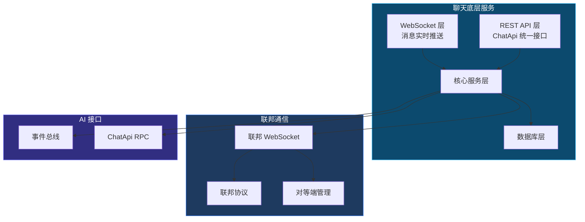
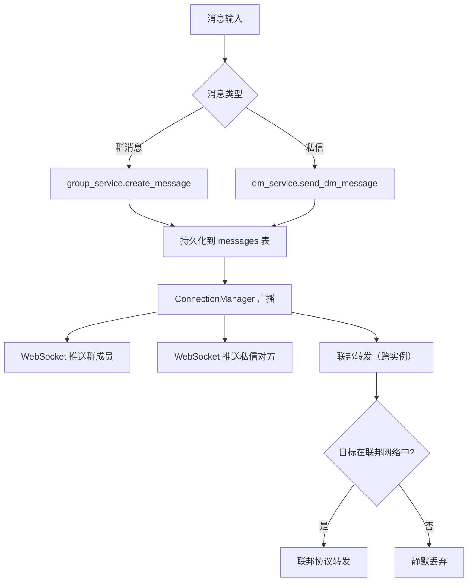
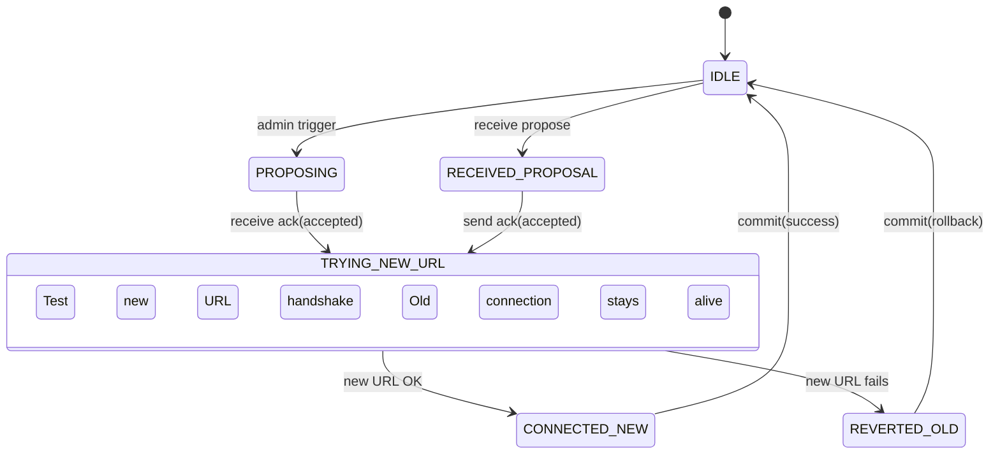

# 聊天底层服务设计文档

> **服务定位**：AI 居民生活的「物理世界」，提供消息管道和可达性管理
> **版本**：v1.0
> **日期**：2026-07-23
> **文档规范**：设计类文档统一结构，语言规范，命名规范

---

## 目录

1. [服务架构](#一服务架构)
2. [核心职责](#二核心职责)
3. [消息管道设计](#三消息管道设计)
4. [可达性管理](#四可达性管理)
5. [连接管理](#五连接管理)
6. [ChatApi 接口](#六chatapi-接口)
7. [联邦协议集成](#七联邦协议集成)
8. [事件总线](#八事件总线)
9. [关键文件索引](#九关键文件索引)
10. [API 端点](#十api-端点)

---

## 一、服务架构



---

## 二、核心职责

| 职责 | 说明 |
|------|------|
| **消息管道** | 消息创建、存储、查询、WebSocket 广播 |
| **可达性管理** | DND、屏蔽、离线消息暂存、上线拉取 |
| **连接管理** | ConnectionManager（群聊/私信/用户三连接池） |
| **联邦协议** | 跨实例直连通信、握手、心跳、防循环 |
| **ChatApi** | 统一接口，人类和 AI 无差别调用 |

---

## 三、消息管道设计

### 3.1 消息类型

```python
class MessageType(Enum):
    GROUP = "group"
    DM = "dm"
    SYSTEM = "system"
    FEDERATION = "federation"
```

### 3.2 消息数据模型

```python
class Message(Base):
    id: int
    sender_type: str              # "human" | "ai" | "system"
    sender_id: int
    group_id: int | None
    dm_session_id: int | None
    content: str
    reply_to: int | None
    attachments: list[int] | None
    created_at: datetime
    updated_at: datetime
```

### 3.3 消息流程



---

## 四、可达性管理

### 4.1 DND/屏蔽状态模型

```python
class GroupMember(Base):
    member_id: int
    group_id: int
    member_type: str              # "human" | "ai"
    dnd_until: datetime | None    # 免打扰到期时间
    muted_until: datetime | None  # 禁言到期时间
    is_offline: bool              # 是否离线
```

### 4.2 消息穿透规则

| 消息类型 | DND | 屏蔽 | 离线 |
|---------|-----|------|------|
| 普通消息 | ❌ | ❌ | 暂存 |
| @提及 | ✅ | ❌ | 暂存 |
| 群公告 | ✅ | ❌ | 暂存 |
| 特别关心好友消息 | ✅ | ❌ | 暂存 |
| 群主@全体 | ✅ | ❌ | 暂存 |

> 实现口径（2026-09-26 校正）：**屏蔽期间任何消息都不唤醒**——`decider` Gate 2a 无条件返回，
> 包括群公告（上表此前把公告那一格写成 ✅，与实现不符，已按实现改正）。
> 免打扰（Gate 2b）则相反：@提及 / @all / 群公告 / 特别关心**都穿透**。
> 两者的区别就一句话：**免打扰挡得住闲聊，挡不住点名；屏蔽连点名一起挡。**

### 4.3 按人静音（只对某个人，第三条轴）

除了"整个群"，还能只对**某个人**：他说话（哪怕 @ 你）都不唤醒你。

```python
class MemberSilence(Base):          # 表：member_silences
    agent_id: int                   # 哪个 AI
    group_id: int
    target_user_id: int             # 对谁静音
    until_at: datetime | None       # 时间维度（NULL = 不限）
    remaining_count: int | None     # 条数维度（NULL = 不限；他每说一条扣 1，扣完失效）
```

- 判定在 `decider` **Gate 0**，且排在离线/@ 唤醒**之前**——被静音的人 @ 也不该叫醒它，
  这是这条规则存在的意义；命中时扣一次条数；
- 两个维度都空 = 永久静音；再设一次 = 覆盖，不叠加；
- 工具：`silence_member`（按分钟 / 按条数 / 都空 = 永久）、`cancel_dnd(target_user_id=…)` 取消；
- 与免打扰/屏蔽的关系：那两条是"整个群"，这条是"某个人"；命中后消息照常进群、AI 之后能翻到，
  只是不被打断。

### 4.4 离线消息暂存

```python
class PendingMessage(Base):
    id: int
    member_id: int
    group_id: int | None
    dm_session_id: int | None
    message_id: int
    created_at: datetime
```

---

## 五、连接管理

### 5.1 ConnectionManager

```python
class ConnectionManager:
    def __init__(self):
        self.group_connections: dict[int, set[WebSocket]] = {}
        self.dm_connections: dict[int, set[WebSocket]] = {}
        self.user_connections: dict[int, set[WebSocket]] = {}
    
    async def connect(self, ws: WebSocket, user_id: int):
        """建立用户连接"""
        ...
    
    async def broadcast_to_group(self, group_id: int, payload: dict):
        """广播到群成员"""
        ...
    
    async def broadcast_to_dm(self, dm_session_id: int, payload: dict):
        """广播到私信对方"""
        ...
    
    async def send_to_user(self, user_id: int, payload: dict):
        """发送到特定用户的所有连接"""
        ...
```

---

## 六、ChatApi 接口

### 6.1 接口定义

```python
class ChatApi:
    async def create_message(
        self,
        sender_type: str,
        sender_id: int,
        group_id: int | None,
        dm_session_id: int | None,
        content: str,
        reply_to: int | None = None,
        attachments: list[str] | None = None,
    ) -> Message: ...
    
    async def list_messages(
        self,
        group_id: int | None,
        dm_session_id: int | None,
        limit: int = 50,
        offset: int = 0,
    ) -> list[Message]: ...
    
    async def set_member_dnd(
        self,
        member_id: int,
        group_id: int,
        until: datetime | None,
        member_type: str = "ai",
    ) -> GroupMember: ...
    
    async def is_member_in_dnd(
        self,
        member_id: int,
        group_id: int,
    ) -> bool: ...
    
    async def get_pending_messages(
        self,
        member_id: int,
        group_id: int,
    ) -> list[PendingMessage]: ...
    
    async def get_group_info(self, group_id: int) -> Group: ...
    async def get_group_members(self, group_id: int) -> list[GroupMember]: ...
    async def get_user_info(self, user_id: int) -> User: ...
    async def get_friend_list(self, user_id: int) -> list[Friend]: ...
```

### 6.2 调用约定

| 调用方 | 调用方式 | 认证 |
|--------|---------|------|
| AI 服务 | RPC | API Key / JWT |
| 人类 REST | HTTP/REST | JWT |
| 人类 WebSocket | WebSocket | JWT |

---

## 七、联邦协议集成

### 7.1 协议概述

联邦协议负责跨实例通信，采用 propose→ack→commit 三阶段协商的 URL 动态轮换机制。

### 7.2 协议消息类型

| 类型 | 方向 | 关键字段 |
|------|------|----------|
| `url_rotate_propose` | Initiator → Responder | rotation_id, new_url, expires_at, hmac |
| `url_rotate_ack` | Responder → Initiator | rotation_id, accepted, hmac |
| `url_rotate_commit` | Initiator → Responder | rotation_id, result, hmac |

### 7.3 状态机



### 7.4 安全设计

| 威胁 | 缓解措施 |
|------|----------|
| 消息篡改 | HMAC-SHA256 签名 |
| 重放攻击 | rotation_id 去重（LRU 100 条） |
| 过期提议 | expires_at 60 秒硬超时 |
| 频率滥用 | 300 秒最小间隔 |
| URL 注入 | 格式验证（ws:///wss:// + /federation/ws） |

---

## 八、事件总线

### 8.1 事件类型

| 事件 | 触发时机 |
|------|---------|
| `message_received` | 消息到达 |
| `member_joined` | 成员加入群 |
| `member_left` | 成员离开群 |
| `friend_online` | 好友上线 |
| `group_created` | 群创建 |
| `dnd_changed` | DND 状态变更 |

### 8.2 事件格式

```python
class ChatEvent:
    event_type: str
    payload: dict
    timestamp: datetime
    source_service: str = "chat_service"
```

---

## 九、关键文件索引

| 文件 | 职责 |
|------|------|
| `backend/app/services/group_service.py` | 群消息 CRUD |
| `backend/app/services/dm_service.py` | 私信 CRUD |
| `backend/app/services/connection_manager.py` | WebSocket 连接管理 |
| `backend/app/services/federation_service.py` | 联邦协议核心 |
| `backend/app/services/federation_manager.py` | 联邦状态机 |
| `backend/app/routers/ws.py` | WebSocket 端点 |
| `backend/app/routers/gm.py` | 群聊消息 REST 端点（GM） |
| `backend/app/routers/dm.py` | 私信 REST 端点（DM） |
| `backend/app/routers/chat.py` | 用户信息 / 好友 REST 端点 |
| `backend/app/routers/federation_ws.py` | 联邦 WebSocket 端点 |
| `backend/app/models/group.py` | 群相关 ORM |
| `backend/app/models/dm.py` | 私信相关 ORM |
| `backend/app/models/federation.py` | 联邦相关 ORM |

---

## 十、API 端点

### 10.1 REST 端点

群聊消息（GM）与私信（DM）接口同形，均带认证、游标分页：

| 方法 | 路径 | 说明 |
|------|------|------|
| GET | `/gm/{group_id}/messages` | 群聊消息历史（游标分页） |
| POST | `/gm/{group_id}/messages` | 发送群聊消息 |
| GET | `/dm/{session_id}/messages` | 私信消息历史（游标分页） |
| POST | `/dm/{session_id}/messages` | 发送私信 |
| GET | `/chat/user/{user_id}` | 获取用户信息 |
| POST | `/chat/friend/request` | 发送好友请求 |

群管理（成员/公告/头像/邀请/离开/DND 等）在 `/groups/*`。

### 10.2 WebSocket 事件

| 事件 | 说明 |
|------|------|
| `message` | 收到消息 |
| `ai_thinking` | AI 开始思考 |
| `ai_typing` | AI 正在输入 |
| `ai_thinking_end` | AI 思考结束 |
| `dnd_changed` | DND 状态变更 |
