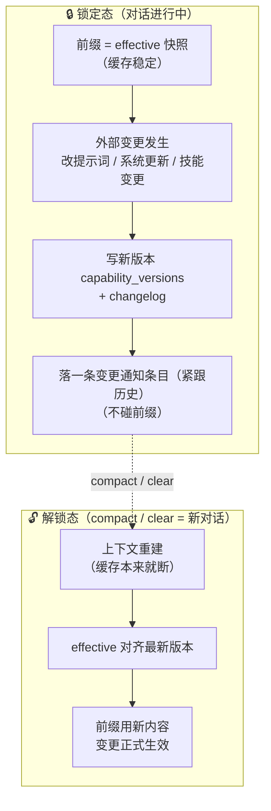

# 能力懒加载：skills/tools 版本化 + 增量变更注入

> 设计口径：给每个 AI 记「已告知版本」与「生效版本」——请求时对比已知与最新，只注入差异段（变更通知），
> 注入即更新已知版本，所以每次注入的都是新变化、且只有新变化；compact 之后上下文重建，工具与技能直接用最新定义。

## 背景问题

平台或世界改动 skills/tools 时，目前**没有懒加载保证**：
- tools 每次请求现算（`get_allowed_tools`），平台/世界一改，下一次请求就带新定义 → 该 AI 所有对话的前缀缓存直接断
- 现有 `pending_system_prompt` 只覆盖 system prompt（已实现：AI 自修改暂存，压缩时切到 current），
  **tools/skills 没有等价机制**（确认：v2.0.5 pending_system_prompt 真实生效于 executor 压缩后 `apply_pending_config`）

## 机制（产品方案）

### 版本号（每个 AI 存两份）
- **known_version**（告知进度）：AI 已收到变更通知的版本——控制**增量注入**
- **effective_version**（生效进度）：AI 当前请求实际使用的工具定义版本——控制 **tools 数组**（compact 前保持旧定义，前缀缓存稳定）

### 变更流程
1. 能力源（平台工具 / 世界 skill）变更 → 生成新版本 + 变更摘要（changelog）
2. AI 响应时对比：`known < latest` → 注入**差异部分**（v_known+1 → v_latest 的 changelog 摘要，追加 system 消息）
   ——每次注入的都是新变化、只有新变化；之前注入过的不会重复
3. **注入成功（消息进入上下文）→ known_version 更新为 latest**
4. **compact 之后**：上下文重建（缓存本来就断）→ effective_version = latest，工具定义直接用最新，无需再走增量

### 不变式
- 请求 payload 的 tools 数组 = **effective 快照 ∩ 当前允许集**（同名工具的更新在锁定态不动字节 → 前缀缓存稳定）
- 变更告知 = 紧跟历史的账本条目（在尾部动态块之前；不进静态前缀，机制见 [帧、锁与重建点](./frame_lifecycle.md)）
- **改定义不改字节，增删工具会改**——两个源的保护程度不同：
  - 平台内置工具：请求时还要求一次交集——`response_worker.py:866` 先按现行插件注册表 + 状态白名单算出
    `allowed_names`，再拿快照过滤。删掉一个工具，它**不会**留在请求里；代价是这次请求的 tools 数组跟着变
    （一次躲不掉的 miss），模型若凭记忆调它，`dispatch` 回 `UNKNOWN_TOOL`「未知工具「X」：没有此名称的工具」
    （`tools/base.py:340`）。
  - 世界技能（`ai-skills` / `world-{id}`）：**没有这层交集**——`tools_for_world = [*WORLD_TOOLS, *effective_skill_tools]`
    （`world_chat_service.py:1472`），群 AI 的居民能力也直接拼快照（`response_worker.py:890-898`）。
    删掉一个 skill 后，锁定态的工具数组里仍然有它，模型调用时 `execute_skill` 找不到、同样回 `UNKNOWN_TOOL`。
    要让世界源也"删了就消失"，得在拼装处补一次交集（会改字节，但删能力这次本来也该 miss）。
  - 同一条不变式也管状态闸：`thinking_enabled` 隐藏 `toggle_thinking`、`delay_reply_allowed` 裁 `manage_skills`，
    这些都会改 tools 数组（与平台发布无关），别把"tools 数组稳定"理解成绝对。
- 平台代码发布：同名工具的旧定义保留在 DB，重启后锁定态会话继续用旧定义请求，等自然 compact 切新版。

### 与状态帧、触发组合规则的关系

"锁"和触发规则里的"帧"都以 compact / clear 为参照点，但不是同一个容器：锁住的是**前缀字节**
（`agents.cap_effective_versions` / `worlds.config`），帧是**会话状态容器**（`agents.state_stack` 栈顶帧：
便签副本 + `tool_uses` / `delivered`）。解锁时锁**换新**（effective 对齐 latest）、帧对象**不重建**但身上的
触发规则状态**复位**（`reset_trigger_state`）；谁动谁不动只在 [帧、锁与重建点](./frame_lifecycle.md) 表里维护。

### 并发与一致性

- **known 的推进与通知落库同事务**：`build_change_notice` 就地改 `cap_known_versions`，通知经 `append_events`
  写进账本，同一个 session 提交——不会出现"通知发出去了、版本没记住"的重复注入。
- **盖章位置**：便签投递的章就是账本条目本身（`delivered_note_ids` 反查）；"便签撤下通知"的章在会话帧的
  `notified` 上（`mark_frame_notes_notified`），与通知同一次构建落库——掉电或异常最多多发一次，不会漏发。
- **并发假设：单实例**。当前部署是一个 uvicorn 进程（无 `--workers`），同一个 AI 的上下文构建不并发。
  `cap_known_versions` / `cap_effective_versions` 是 JSONB 整块覆盖，全仓没有 `FOR UPDATE`：
  真要多实例，得先给这两个 map 加乐观锁（行锁或版本号），否则两个进程同时构建会互相覆盖。

## 数据模型

- `capability_versions`：**统一能力源版本表**（source, version, changelog, definitions JSONB nullable, created_at）
  - 能力源 = **平台**（platform：内置工具定义）+ **每个世界**（world-{id}：世界 skills 生成的工具定义）
  - 世界 skills/tools **同样版本化**：世界 skill 目录哈希变化 → 新版本 + changelog（新增/修改/删除的 skill 摘要）
  - 平台源存 definitions（内置工具定义快照）；世界源同样存 definitions（该世界 skills 转出的工具定义）——旧版本保留，compact 前照旧用
- `agents.cap_known_versions` JSONB：{source: version} 告知进度
- `agents.cap_effective_versions` JSONB：{source: version} 生效进度

## 落地范围

1. ✅ 平台启动：注册内置工具 → 生成定义 → 哈希对比 → 变更则写新版本（旧版本保留）——`main.py` lifespan
2. ✅ 世界 skill 目录：变更检测（哈希）→ capability_versions 写新版本（含工具定义快照）——`world_chat_service`
3. ✅ 注入：build_messages / world_chat_service 时检测落后 → 追加变更通知 system 消息 → 更新 known（同事务）
4. ✅ compact：executor 压缩成功后 effective = latest（扩展 apply_pending_config）；世界 AI 压缩在 compact_context 工具内
5. ✅ 群 AI 世界能力：world_command 稳定工具（缓存友好）+ 能力清单尾部化

## 实现（2026-08-06 650f1cb）

- `capability_versions` 表：source（platform / world-{id}）+ version + content_hash + changelog + definitions 快照，旧版本保留
- `agents.cap_known_versions` / `cap_effective_versions`（JSONB）；世界 AI 用 `worlds.config` 同名字段（holder 泛化：agent 对象或 dict）
- `app/services/capability_versioning.py`：ensure_source_version（diff 自动 changelog）/ get_effective_definitions（快照回退）/ build_change_notice（增量注入）/ mark_effective_latest
- 已接：平台源（群 AI/DM 对话 tools + 变更通知 + compact 切换）、世界源（世界 AI 工具集 + 变更通知 + compact_context 切换）
- 验证：幂等 / 增量注入（known=v2 只注入 v3）/ effective 快照（旧定义请求）/ compact 切最新 / dict holder 全过

---

# 前缀内容版本化 + 锁定/解锁（扩展）

> 设计口径：改提示词、系统更新都是正常操作，不该断缓存——凡是进前缀的内容都必须保证缓存命中。

## 核心原则

**所有进前缀的内容必须保证缓存命中**——不只是 skill/tools，还包括：

| 前缀内容 | 变更来源 | 是否常见 |
|---------|---------|---------|
| 用户可改 system_prompt（世界 AI 人设） | 用户设计页修改 | **常见（正常操作）** |
| 强注入提示词段（工具约定/能力边界/运行规范） | 系统版本更新 | 低频但正常 |
| skill/tools 定义 | 造物主颁布 / 平台发布 | 常见 |
| 昵称等配置 | 用户修改 | 常见 |

**变更 = 正常内容，不是异常**。用户改提示词、系统更新、造物主改技能，都是产品的正常操作；
如果这些操作导致缓存断，用户会"不知道为什么不玩了"——所以必须统一懒加载。

## 机制：统一 known/effective + 锁定/解锁

### 状态语义

- **锁定态（对话进行中）**：前缀 = effective 版本快照（缓存稳定）；任何外部变更 → 只写新版本 + 落一条变更通知条目（紧跟历史）告知，**不碰前缀**
- **解锁态（compact / clear 之后 = 新对话）**：上下文重建（缓存本来就断）→ effective 对齐最新 → 前缀用新内容。**变更在这里应用**

### 不变式

1. **锁定态前缀永不因变更而变**——用户改提示词、系统更新强注入、造物主改技能，都只写新版本 + 落一条通知条目
2. **变更告知 = 紧跟历史的账本条目**（在尾部动态块之前，不进静态前缀。落地见 [会话历史与前缀缓存](./conversation_history.md) §13 b-3a——别再挪回"当轮尾部消息"，那正是它当初说完就没的病）
3. **尝试在锁定态应用变更（改 effective）→ 拒绝 + 后端报错记录**（防御：防止未来出现"强制修改"逻辑破坏不变式）
4. **compact / clear 是唯一解锁点**——恰好是变更应用的时刻（上下文已重建）
5. **投递的内容在锁定态内字节不变**：跨状态便签投递 = **落一条账本条目**（`note_entry`，历史属于前缀，
   落库即定稿）。投递是**一次性过户**：过户后归这段会话的锁管，来源侧（便签记录）只剩「还能不能投」——
   过期不动它；删除/清空不改已投的那条，只补一条「便签撤下通知」条目（同带 `drop_on_unlock`）。
   「发一次」= **写入一次**，它被看到多久由账本决定（活到解锁），不是只出现一轮。
   解锁（compact/clear）时这两类条目随账本重写离场。
   机制见 [会话历史与前缀缓存](./conversation_history.md) §13 b-3b、[跨状态交接](./cross_state_context.md)

### 锁定态里"只告知"指什么

指**字节**不变，不指 AI 行为不变：通知头写明"以下变更**立即生效**：与系统提示 / 工具描述里的旧表述
冲突时以本通知为准；系统提示全文会在下次 compact / 清空上下文时整体刷新"
（`capability_versioning.build_change_notice`）。强注入段（必须遵守的规则）同理——AI 立刻按新规则行动，
只是前缀里的旧文本要等解锁才被替换。锁定态想改 effective 会被 `guard_apply_change` 拒绝并报错（防御）。

### 为什么 compact/clear 是天然解锁点

- compact：上下文压缩 → 前缀必然重建 → 用最新版本零成本
- clear：清空上下文 → 全新对话 → 用最新版本零成本
- 平时锁定：动态注入告知（AI 知道有变化，按新变化行动），但请求 payload 前缀保持旧快照 → 缓存命中

## 落地清单

1. ✅ `ensure_text_source_version`：文本内容版本化（复用 capability_versions 表，definitions 存文本/字典）——用户 system_prompt、强注入段、昵称都作为源
2. ✅ `get_effective_text`：锁定态取 effective 快照文本（替代实时拼接）
3. ✅ `apply_pending_changes`：解锁时应用（compact/clear 调，对齐 latest，带守卫）
4. ✅ `guard_apply_change`：锁定态应用变更 → 拒绝 + logger.error（防御性报错）
5. ✅ world_chat_service：前缀组装改为 effective 快照 + 变更检测写新版本 + 尾部 changelog（世界 AI 三个源：world-prompt-{id} / forced-prompt / world-name-{id}）
6. ✅ compact_context / clear_context：调用 apply_pending_changes 解锁（三源 + ai-skills 一起对齐）
7. ✅ 主站 agent 同样接入（build_messages / build_dm_messages 的 personality 段走 agent-prompt-{id} 源；executor compact 解锁）——2026-08-12 已实现

> 2026-08-12 已实现并通过真实 DB 端到端验证：锁定态改提示词 effective 不变 → 尾部 changelog 告知 → compact 解锁生效。

## 与现有机制的合并

- skill/tools 已走 capability_versioning（known/effective）——**同一套机制扩展到文本内容**，不另起炉灶
- 能力变更通知（按版本投一次）与[触发规则](./trigger_rules.md)各管一段：通知仍走本文机制，触发规则里的 `scope: version` 未实现（见该文「未落地」），两者暂不合并
- `pending_system_prompt`（主站 AI 自改暂存）→ 语义并入"锁定态写新版本 + 解锁时应用"，统一为源版本化
- holder 泛化已支持（agent 对象 / worlds.config dict）——世界 AI 与群 AI 同一套代码路径
- **账本化（已落地，分批进度见[会话历史与前缀缓存](./conversation_history.md) §13）**：会话上下文 = 两卷历史 +
  段内只追加，compact / 超时压缩是唯一重写点；本文件的**快照检测保留且两件事都干**——生效（锁住前缀字节）
  + 告知（算差异决定通知什么）。通知已**落成历史条目**（`append_events`），不再是当轮 append 即丢。
- **投递式内容**（跨状态便签）= 锁的另一种用法：不是"等解锁才生效"，而是"落进账本（历史属于前缀）后在锁内保持不变"；
  和变更通知条目互补：前者要长期留在上下文，后者只告知一次（写入一次，活到解锁）
- 动态块的落位纪律：状态栈摘要 / 当前任务 / 通道规矩 / 好友申请 / 私信会话列表都**不进 message 0**，
  一律沉到历史之后的尾部（前缀 = 静态段 + 历史，缓存才稳）
- **changelog（能力变更通知）的第二级纪律**：它不是 tail_blocks，而是**紧跟历史落成账本条目**——顺序固定为
  「便签投递 → 便签撤下通知 → 能力变更通知」，都在 tail_blocks 之前；世界源的能力变更通知挂在世界能力清单
  那一段，单独一条 system 消息（`llm.py` 群路径）。多源同轮触发**不合并**，各占一条，顺序即上述顺序。
- "以本通知为准"针对的是**通知与静态前缀里的旧表述**冲突（前缀要等解锁才刷新），不是通知之间；
  每条通知自带来源与版本区间（`【能力变更通知 · 源 vA→vB】`），不同源各说各的，不存在互相覆盖。
- **同轮条数**：平台 / 提示词 / 记忆索引三类源在一次 `build_change_notice` 调用里就合并成一条（多段
  `【能力变更通知 · 源 vA→vB】` 拼在同一个字符串里）；世界源按绑定世界各一条（`llm.py` 的世界循环，
  去重后与绑定世界数同阶）。所以同轮条数 = 1 + 该群绑定世界数，没有另设上限；要压到两条以内，把世界循环里
  的通知收集起来合成一条再落库即可。
