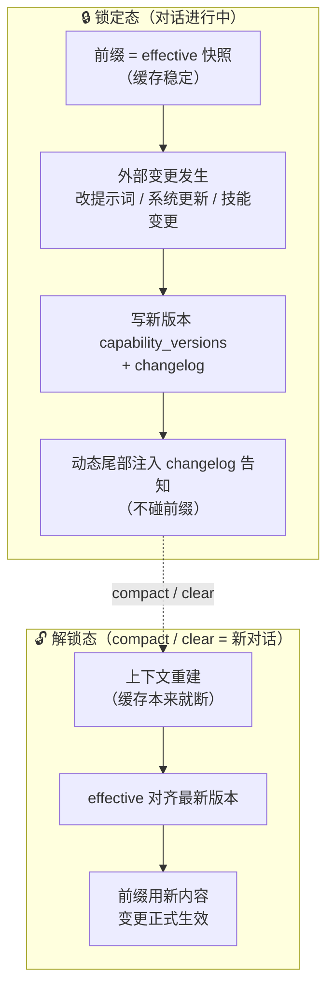

# 能力懒加载：skills/tools 版本化 + 增量变更注入

> 2026-08-06 产品定（原话记录）：
>
> "那不如对比一下每一个AI当前LLM的skills或者tools是否有差异。不过版本更好，这样给每一个LLM存储一下版本号，然后和现有版本号进行对比，如果有差异就注入差异的skills和tools变更通知；注入成功后将版本号更新；compact之后skills和tools直接用最新的就行。这样甚至还能保证每次注入的都有新变化的且只有新变化的，例如我之前注入过一次，那么这次只会注入变化后再变化的；之前变化了的而这次没有变化的变化也在我的LLM里面。"

## 背景问题

平台或世界改动 skills/tools 时，目前**没有懒加载保证**：
- tools 每次请求现算（`get_allowed_tools`），平台/世界一改，下一次请求就带新定义 → 该 AI 所有对话的前缀缓存直接断
- 现有 `pending_system_prompt` 只覆盖 system prompt（已实现：AI 自修改暂存，压缩时切到 current），
  **tools/skills 没有等价机制**（确认：v2.0.5 pending_system_prompt 真实生效于 executor 压缩后 `apply_pending_config`）

## 机制（产品方案）

### 版本号（每个 AI 存两份）
- **known_version**（告知进度）：AI 已收到变更通知的版本——控制**增量注入**
- **effective_version**（生效进度）：AI 当前请求实际使用的工具定义版本——控制 **tools 数组**（compact 前保持旧定义，前缀缓存稳定）

### 变更流程
1. 能力源（平台工具 / 世界 skill）变更 → 生成新版本 + 变更摘要（changelog）
2. AI 响应时对比：`known < latest` → 注入**差异部分**（v_known+1 → v_latest 的 changelog 摘要，追加 system 消息）
   ——每次注入的都是新变化、只有新变化；之前注入过的不会重复
3. **注入成功（消息进入上下文）→ known_version 更新为 latest**
4. **compact 之后**：上下文重建（缓存本来就断）→ effective_version = latest，工具定义直接用最新，无需再走增量

### 不变式
- 请求 payload 的 tools 数组 = effective_version 的定义（compact 前不动 → 前缀缓存稳定）
- 变更告知 = 动态尾部 system 消息（不影响前缀）
- 删除的工具：执行时兜底"该工具已下线"（AI 自然学会不用）
- 平台代码发布：旧版本定义保留在 DB，重启后旧对话继续用旧定义请求，等自然 compact 切新版

## 数据模型

- `capability_versions`：**统一能力源版本表**（source, version, changelog, definitions JSONB nullable, created_at）
  - 能力源 = **平台**（platform：内置工具定义）+ **每个世界**（world-{id}：世界 skills 生成的工具定义）
  - 世界 skills/tools **同样版本化**：世界 skill 目录哈希变化 → 新版本 + changelog（新增/修改/删除的 skill 摘要）
  - 平台源存 definitions（内置工具定义快照）；世界源同样存 definitions（该世界 skills 转出的工具定义）——旧版本保留，compact 前照旧用
- `agents.cap_known_versions` JSONB：{source: version} 告知进度
- `agents.cap_effective_versions` JSONB：{source: version} 生效进度

## 落地范围

1. ✅ 平台启动：注册内置工具 → 生成定义 → 哈希对比 → 变更则写新版本（旧版本保留）——`main.py` lifespan
2. ✅ 世界 skill 目录：变更检测（哈希）→ capability_versions 写新版本（含工具定义快照）——`world_chat_service`
3. ✅ 注入：build_messages / world_chat_service 时检测落后 → 追加变更通知 system 消息 → 更新 known（同事务）
4. ✅ compact：executor 压缩成功后 effective = latest（扩展 apply_pending_config）；世界 AI 压缩在 compact_context 工具内
5. ✅ 群 AI 世界能力：world_command 稳定工具（缓存友好）+ 能力清单尾部化

## 实现（2026-08-06 650f1cb）

- `capability_versions` 表：source（platform / world-{id}）+ version + content_hash + changelog + definitions 快照，旧版本保留
- `agents.cap_known_versions` / `cap_effective_versions`（JSONB）；世界 AI 用 `worlds.config` 同名字段（holder 泛化：agent 对象或 dict）
- `app/services/capability_versioning.py`：ensure_source_version（diff 自动 changelog）/ get_effective_definitions（快照回退）/ build_change_notice（增量注入）/ mark_effective_latest
- 已接：平台源（群 AI/DM 对话 tools + 变更通知 + compact 切换）、世界源（世界 AI 工具集 + 变更通知 + compact_context 切换）
- 验证：幂等 / 增量注入（known=v2 只注入 v3）/ effective 快照（旧定义请求）/ compact 切最新 / dict holder 全过

---

# 前缀内容版本化 + 锁定/解锁（2026-08-12 产品定，扩展）

> 产品原话："用户每次都改提示词呢？缓存一个没触发，直接就不玩了，用户也不知道为什么，因为改提示词本来就是正常现象。所以肯定所有的一切放在前面的都必须保证缓存命中。"
>
> "包括系统更新也是正常内容和操作，不应该断缓存。"

## 核心原则

**所有进前缀的内容必须保证缓存命中**——不只是 skill/tools，还包括：

| 前缀内容 | 变更来源 | 是否常见 |
|---------|---------|---------|
| 用户可改 system_prompt（世界 AI 人设） | 用户设计页修改 | **常见（正常操作）** |
| 强注入提示词段（工具约定/能力边界/运行规范） | 系统版本更新 | 低频但正常 |
| skill/tools 定义 | 造物主颁布 / 平台发布 | 常见 |
| 昵称等配置 | 用户修改 | 常见 |

**变更 = 正常内容，不是异常**。用户改提示词、系统更新、造物主改技能，都是产品的正常操作；
如果这些操作导致缓存断，用户会"不知道为什么不玩了"——所以必须统一懒加载。

## 机制：统一 known/effective + 锁定/解锁

### 状态语义

- **锁定态（对话进行中）**：前缀 = effective 版本快照（缓存稳定）；任何外部变更 → 只写新版本 + 动态尾部注入 changelog 告知，**不碰前缀**
- **解锁态（compact / clear 之后 = 新对话）**：上下文重建（缓存本来就断）→ effective 对齐最新 → 前缀用新内容。**变更在这里应用**

### 不变式

1. **锁定态前缀永不因变更而变**——用户改提示词、系统更新强注入、造物主改技能，全都只进 changelog 尾部
2. **变更告知 = 动态尾部 system 消息**（不影响前缀）
3. **尝试在锁定态应用变更（改 effective）→ 拒绝 + 后端报错记录**（防御：防止未来出现"强制修改"逻辑破坏不变式）
4. **compact / clear 是唯一解锁点**——恰好是变更应用的时刻（上下文已重建）
5. **投递进前缀的内容在锁定态内字节不变**：跨状态便签投进某个会话后固定位置、固定内容
   （每轮重拼也拼出同样的字节）。投递是**一次性过户**：过户后归这段会话的锁管，来源侧
   （便签记录）只剩「还能不能投」——过期不动它；删除/清空**也不碰前缀**，只在尾部发一条
   「便签撤下通知」（和 changelog 同一个位置、同一句"以本通知为准"，**发一次**，发完盖章）。
   解锁（compact/clear）时才把副本从会话帧里删掉（前缀此刻本来就要重建）。
   详见 [跨状态交接](./cross_state_context.md)

### 为什么 compact/clear 是天然解锁点

- compact：上下文压缩 → 前缀必然重建 → 用最新版本零成本
- clear：清空上下文 → 全新对话 → 用最新版本零成本
- 平时锁定：动态注入告知（AI 知道有变化，按新变化行动），但请求 payload 前缀保持旧快照 → 缓存命中

## 落地清单

1. ✅ `ensure_text_source_version`：文本内容版本化（复用 capability_versions 表，definitions 存文本/字典）——用户 system_prompt、强注入段、昵称都作为源
2. ✅ `get_effective_text`：锁定态取 effective 快照文本（替代实时拼接）
3. ✅ `apply_pending_changes`：解锁时应用（compact/clear 调，对齐 latest，带守卫）
4. ✅ `guard_apply_change`：锁定态应用变更 → 拒绝 + logger.error（防御性报错）
5. ✅ world_chat_service：前缀组装改为 effective 快照 + 变更检测写新版本 + 尾部 changelog（世界 AI 三个源：world-prompt-{id} / forced-prompt / world-name-{id}）
6. ✅ compact_context / clear_context：调用 apply_pending_changes 解锁（三源 + ai-skills 一起对齐）
7. ✅ 主站 agent 同样接入（build_messages / build_dm_messages 的 personality 段走 agent-prompt-{id} 源；executor compact 解锁）——2026-08-12 已实现

> 2026-08-12 已实现并通过真实 DB 端到端验证：锁定态改提示词 effective 不变 → 尾部 changelog 告知 → compact 解锁生效。

## 与现有机制的合并

- skill/tools 已走 capability_versioning（known/effective）——**同一套机制扩展到文本内容**，不另起炉灶
- `pending_system_prompt`（主站 AI 自改暂存）→ 语义并入"锁定态写新版本 + 解锁时应用"，统一为源版本化
- holder 泛化已支持（agent 对象 / worlds.config dict）——世界 AI 与群 AI 同一套代码路径
- **账本化（2026-09-25 定，待落地）**：会话上下文改成"两卷历史 + 只追加"，compact / 超时压缩是唯一重写点；
  本文件的**快照检测保留且两件事都干**——生效（锁住前缀字节）+ 告知（算差异决定通知什么），
  唯一变化是"通知要落成历史条目，不再当轮 append 即丢"。详见 [会话历史与前缀缓存](./conversation_history.md)
- **投递式内容**（跨状态便签）= 锁的另一种用法：不是"等解锁才生效"，而是"投进前缀后在锁内保持不变"；
  和尾部动态注入（changelog）互补：前者要长期留在上下文，后者只告知一次
- 动态块的落位纪律：状态栈摘要 / 当前任务 / 通道规矩 / 好友申请 / 私信会话列表都**不进 message 0**，
  一律沉到历史之后的尾部（前缀 = 静态段 + 历史，缓存才稳）
