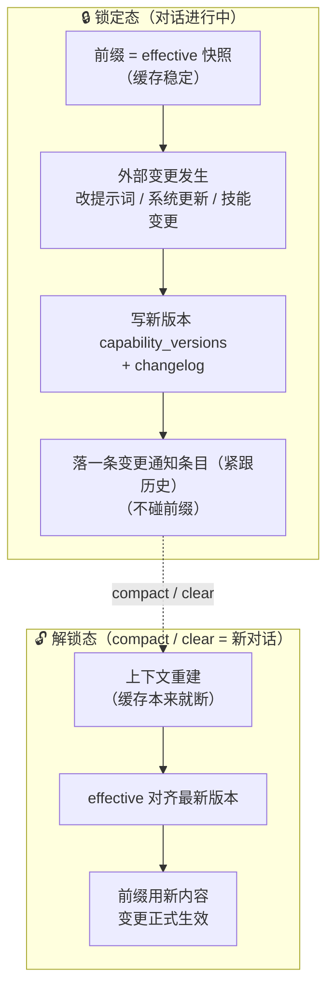

# 能力懒加载：skills/tools 版本化 + 增量变更注入

> 设计口径：给每个 **状态**记「已告知版本」与「生效版本」——请求时对比已知与最新，只注入差异段（变更通知），
> 注入即更新已知版本，所以每次注入的都是新变化、且只有新变化；compact 之后该状态上下文重建，工具与技能直接用最新定义。
> 状态的粒度与作用域语义见「作用域（scope）」一节。

## 背景问题

平台或世界改动 skills/tools 时，目前**没有懒加载保证**：
- tools 每次请求现算（`get_allowed_tools`），平台/世界一改，下一次请求就带新定义 → 该 AI 所有对话的前缀缓存直接断
- 现有 `pending_system_prompt` 只覆盖 system prompt（已实现：AI 自修改暂存，压缩时切到 current），
  **tools/skills 没有等价机制**（确认：v2.0.5 pending_system_prompt 真实生效于 executor 压缩后 `apply_pending_config`）

## 机制（产品方案）

### 进度（每个 AI 存两份，均按**状态**各记一份）

进度键为 `{状态}|{源}`；状态即会话键（群 `group:{id}`、私信 `{a}_{b}`）。

- **known_version**（告知进度）：该状态已收到变更通知的版本——控制**增量注入**
- **effective_version**（生效进度）：该状态的前缀实际使用的定义版本——控制 **tools 数组**与文本段（compact 前保持旧定义，前缀缓存稳定）

按状态记账为强制要求：进度若挂在 AI 级，先构建提示词的状态会把版本推平，其余状态再也收不到那条变更。

### 作用域（scope）

版本行携带作用域，决定这条变更应通知哪些状态。取值仅两种：

| 取值 | 含义 |
|------|------|
| `*`（`SCOPE_ALL`） | 全部状态。适用于"每个状态的前缀里装同一份"的内容：平台工具、提示词、记忆索引 |
| 会话键 / `focus:{id}` | 仅该会话；或该会话焦段下的会话（预置焦段「所有聊天」恒命中） |

人格段（提示词）有**两个源**：本体 `agent-prompt-{id}`，以及某个用户的人格覆盖
`agent-prompt-{id}-u{uid}`——两份文本不能共用一个源（哈希每轮都不一样，会一轮写一个新版本）。
两个源都用 `*`：覆盖只影响那个用户的会话，"某个用户的全部会话"这种粒度表达不出来，
按本文一贯口径"宁可多通知，也不能静默"处理。

**写入时 `scope` 为必填项。** 写 `*` 是全部；不写 `*` 即当前会话（由调用方传入该会话键）。全局必须显式表态：漏写的失败形态是静默不投递，属最难排查的一类缺陷；反之最多只是多通知，可观测。

存量行的 `scope` 为空，读取时按 `*` 处理。本机制落地前进度挂在 AI 级，语义上即为全部；按全部处理可避免历史变更被静默丢弃。

### 变更流程

1. 能力源（平台工具 / 世界 skill / 提示词 / 记忆索引）变更 → 生成新版本 + 变更摘要（changelog）+ 作用域
2. 某状态构建提示词时，与**本状态**的进度对比 `known < latest`：
   - 作用域覆盖本状态的版本 → 注入其 changelog（v_known+1 → v_latest，只含新变化，已注入过的不重复）
   - 作用域不覆盖本状态的版本 → 不注入内容，但**同样将 known 推进到 latest**（与该版本结清，否则每轮重扫）
3. **注入与 known 推进同事务**（不出现"通知发出、版本未记"的重复注入）
4. **compact / clear 之后**：该状态上下文重建（缓存本来就断）→ **该状态**的 effective 对齐 latest；其他状态不受影响

### 不变式
- **锁与状态同构**：effective 表达"这个状态的前缀锁在哪一版"，只能由该状态自己的 compact / clear 推进；任何状态的解锁不得改动其他状态的 effective（否则那些状态的前缀从第 0 字节起 miss）
- 请求 payload 的 tools 数组 = **effective 快照 ∩ 当前允许集**（同名工具的更新在锁定态不动字节 → 前缀缓存稳定）
- 变更告知 = 紧跟历史的账本条目（在尾部动态块之前；不进静态前缀，机制见 [帧、锁与重建点](./frame_lifecycle.md)）
- **改定义不改字节，增删工具会改**——两个源的保护程度不同：
  - 平台内置工具：请求时还要求一次交集——`response_worker.py:866` 先按现行插件注册表 + 状态白名单算出
    `allowed_names`，再拿快照过滤。删掉一个工具，它**不会**留在请求里；代价是这次请求的 tools 数组跟着变
    （一次躲不掉的 miss），模型若凭记忆调它，`dispatch` 回 `UNKNOWN_TOOL`「未知工具「X」：没有此名称的工具」
    （`tools/base.py:340`）。
  - 世界技能（`ai-skills` / `world-{id}`）：**没有这层交集**——`tools_for_world = [*WORLD_TOOLS, *effective_skill_tools]`
    （`world_chat_service.py:1472`），群 AI 的居民能力也直接拼快照（`response_worker.py:890-898`）。
    删掉一个 skill 后，锁定态的工具数组里仍然有它，模型调用时 `execute_skill` 找不到、同样回 `UNKNOWN_TOOL`。
    要让世界源也"删了就消失"，得在拼装处补一次交集（会改字节，但删能力这次本来也该 miss）。
  - 同一条不变式也管状态闸：`thinking_enabled` 隐藏 `toggle_thinking`、`delay_reply_allowed` 裁 `manage_skills`，
    这些都会改 tools 数组（与平台发布无关），别把"tools 数组稳定"理解成绝对。
- 平台代码发布：同名工具的旧定义保留在 DB，重启后锁定态会话继续用旧定义请求，等自然 compact 切新版。

### 与状态帧、触发组合规则的关系

"锁"和触发规则里的"帧"都以 compact / clear 为参照点，但不是同一个容器：锁住的是**前缀字节**
（`agents.cap_effective_versions` / `worlds.config`，键内含状态），帧是**会话状态容器**（`agents.state_stack` 栈顶帧：
便签副本 + `tool_uses` / `delivered`）。解锁时锁**换新**（该状态的 effective 对齐 latest）、帧对象**不重建**但身上的
触发规则状态**复位**（`reset_trigger_state`）；谁动谁不动只在 [帧、锁与重建点](./frame_lifecycle.md) 表里维护。

进度为何不放进状态帧：帧记录是**可删的**——他交接完后事就删（`finish_frame`），积压超限或这档不接手后事时平台还会代销；
进度若挂在一个会被删的容器上，会话换回来时会被当作"新源"对齐 latest，反而使该会话前缀突变换字节。
何况世界 AI 的 holder 是 `worlds.config`，根本没有帧对象。因此进度留在 holder 的两个 map 内，以状态为键。

### 并发与一致性

- **known 的推进与通知落库同事务**：`build_change_notice` 就地改 `cap_known_versions`（本状态的键），通知经 `append_events`
  写进账本，同一个 session 提交——不会出现"通知发出去了、版本没记住"的重复注入。
- **盖章位置**：便签投递的章就是账本条目本身（`delivered_note_ids` 反查）；"便签撤下通知"的章在会话帧的
  `notified` 上（`mark_frame_notes_notified`），与通知同一次构建落库——掉电或异常最多多发一次，不会漏发。
- **并发假设：单实例**。当前部署是一个 uvicorn 进程（无 `--workers`），同一个 AI 的上下文构建不并发。
  `cap_known_versions` / `cap_effective_versions` 是 JSONB 整块覆盖，全仓没有 `FOR UPDATE`：
  真要多实例，得先给这两个 map 加乐观锁（行锁或版本号），否则两个进程同时构建会互相覆盖。
  按状态记账使键数随会话数增长（每会话每源一键），键值覆盖的粒度不变。

## 数据模型

- `capability_versions`：**统一能力源版本表**（source, version, changelog, definitions JSONB nullable, scope, created_at）
  - 能力源 = **平台**（platform：内置工具定义）+ **每个世界**（world-{id}：世界 skills 生成的工具定义）
  - 世界 skills/tools **同样版本化**：世界 skill 目录哈希变化 → 新版本 + changelog（新增/修改/删除的 skill 摘要）
  - 平台源存 definitions（内置工具定义快照）；世界源同样存 definitions（该世界 skills 转出的工具定义）——旧版本保留，compact 前照旧用
- `capability_versions.scope`：变更作用域（`*` 或会话键 / `focus:{id}`，写入必填；存量行为空，读取按 `*` 处理）
- `agents.cap_known_versions` JSONB：`{"{状态}|{源}": version}` 告知进度
- `agents.cap_effective_versions` JSONB：`{"{状态}|{源}": version}` 生效进度
- 世界 AI 用 `worlds.config` 同名字段。世界 = 一世界一对话，状态键退化为空，键即 `{源}`，行为与改造前一致

## 落地范围

1. ✅ 平台启动：注册内置工具 → 生成定义 → 哈希对比 → 变更则写新版本（旧版本保留）——`main.py` lifespan
2. ✅ 世界 skill 目录：变更检测（哈希）→ capability_versions 写新版本（含工具定义快照）——`world_chat_service`
3. ✅ 注入：build_messages / world_chat_service 时检测落后 → 追加变更通知 system 消息 → 更新 known（同事务）
4. ✅ compact：executor 压缩成功后 effective = latest（扩展 apply_pending_config）；世界 AI 压缩在 compact_context 工具内
5. ✅ 群 AI 世界能力：world_command 稳定工具（缓存友好）+ 能力清单尾部化

## 实现（2026-08-06 650f1cb）

- `capability_versions` 表：source（platform / world-{id}）+ version + content_hash + changelog + definitions 快照，旧版本保留
- `agents.cap_known_versions` / `cap_effective_versions`（JSONB）；世界 AI 用 `worlds.config` 同名字段（holder 泛化：agent 对象或 dict）
- `app/services/capability_versioning.py`：ensure_source_version（diff 自动 changelog）/ get_effective_definitions（快照回退）/ build_change_notice（增量注入）/ mark_effective_latest
- 已接：平台源（群 AI/DM 对话 tools + 变更通知 + compact 切换）、世界源（世界 AI 工具集 + 变更通知 + compact_context 切换）
- 验证：幂等 / 增量注入（known=v2 只注入 v3）/ effective 快照（旧定义请求）/ compact 切最新 / dict holder 全过

---

# 前缀内容版本化 + 锁定/解锁（扩展）

> 设计口径：改提示词、系统更新都是正常操作，不该断缓存——凡是进前缀的内容都必须保证缓存命中。

## 核心原则

**所有进前缀的内容必须保证缓存命中**——不只是 skill/tools，还包括：

| 前缀内容 | 变更来源 | 是否常见 |
|---------|---------|---------|
| 用户可改 system_prompt（世界 AI 人设） | 用户设计页修改 | **常见（正常操作）** |
| 强注入提示词段（工具约定/能力边界/运行规范） | 系统版本更新 | 低频但正常 |
| skill/tools 定义 | 造物主颁布 / 平台发布 | 常见 |
| 昵称等配置 | 用户修改 | 常见 |

**变更 = 正常内容，不是异常**。用户改提示词、系统更新、造物主改技能，都是产品的正常操作；
如果这些操作导致缓存断，用户会"不知道为什么不玩了"——所以必须统一懒加载。

## 机制：统一 known/effective + 锁定/解锁

### 状态语义

- **锁定态（对话进行中）**：前缀 = effective 版本快照（缓存稳定）；任何外部变更 → 只写新版本 + 落一条变更通知条目（紧跟历史）告知，**不碰前缀**
- **解锁态（compact / clear 之后 = 新对话）**：上下文重建（缓存本来就断）→ effective 对齐最新 → 前缀用新内容。**变更在这里应用**

```mermaid
flowchart TD
    subgraph 锁定态["🔒 锁定态（对话进行中）"]
        A1["前缀 = effective 快照<br/>（缓存稳定）"]
        A2["外部变更发生<br/>改提示词 / 系统更新 / 技能变更"]
        A3["写新版本 capability_versions<br/>+ changelog"]
        A4["落一条变更通知条目（紧跟历史）<br/>（不碰前缀）"]
        A1 --> A2 --> A3 --> A4
    end

    subgraph 解锁态["🔓 解锁态（compact / clear = 新对话）"]
        B1["上下文重建<br/>（缓存本来就断）"]
        B2["effective 对齐最新版本"]
        B3["前缀用新内容<br/>变更正式生效"]
        B1 --> B2 --> B3
    end

    A4 -. "compact / clear" .-> B1
```

### 不变式

1. **锁定态前缀永不因变更而变**——用户改提示词、系统更新强注入、造物主改技能，都只写新版本 + 落一条通知条目
2. **变更告知 = 紧跟历史的账本条目**（在尾部动态块之前，不进静态前缀。落地见 [会话历史与前缀缓存](./conversation_history.md) §13 b-3a——别再挪回"当轮尾部消息"，那正是它当初说完就没的病）
3. **尝试在锁定态应用变更（改 effective）→ 拒绝 + 后端报错记录**（防御：防止未来出现"强制修改"逻辑破坏不变式）
4. **compact / clear 是唯一解锁点**——恰好是变更应用的时刻（上下文已重建）
5. **投递的内容在锁定态内字节不变**：跨状态便签投递 = **落一条账本条目**（`note_entry`，历史属于前缀，
   落库即定稿）。投递是**一次性过户**：过户后归这段会话的锁管，来源侧（便签记录）只剩「还能不能投」——
   过期不动它；删除/清空不改已投的那条，只补一条「便签撤下通知」条目（同带 `drop_on_unlock`）。
   「发一次」= **写入一次**，它被看到多久由账本决定（活到解锁），不是只出现一轮。
   解锁（compact/clear）时这两类条目随账本重写离场。
   机制见 [会话历史与前缀缓存](./conversation_history.md) §13 b-3b、[跨状态交接](./cross_state_context.md)

### 锁定态里"只告知"指什么

指**字节**不变，不指 AI 行为不变：通知头写明"以下变更**立即生效**：与系统提示 / 工具描述里的旧表述
冲突时以本通知为准；系统提示全文会在下次 compact / 清空上下文时整体刷新"
（`capability_versioning.build_change_notice`）。强注入段（必须遵守的规则）同理——AI 立刻按新规则行动，
只是前缀里的旧文本要等解锁才被替换。锁定态想改 effective 会被 `guard_apply_change` 拒绝并报错（防御）。

### 为什么 compact/clear 是天然解锁点

- compact：上下文压缩 → 前缀必然重建 → 用最新版本零成本
- clear：清空上下文 → 全新对话 → 用最新版本零成本
- 平时锁定：动态注入告知（AI 知道有变化，按新变化行动），但请求 payload 前缀保持旧快照 → 缓存命中

## 落地清单

1. ✅ `ensure_text_source_version`：文本内容版本化（复用 capability_versions 表，definitions 存文本/字典）——用户 system_prompt、强注入段、昵称都作为源
2. ✅ `get_effective_text`：锁定态取 effective 快照文本（替代实时拼接）
3. ✅ `apply_pending_changes`：解锁时应用（compact/clear 调，对齐 latest，带守卫）
4. ✅ `guard_apply_change`：锁定态应用变更 → 拒绝 + logger.error（防御性报错）
5. ✅ world_chat_service：前缀组装改为 effective 快照 + 变更检测写新版本 + 尾部 changelog（世界 AI 三个源：world-prompt-{id} / forced-prompt / world-name-{id}）
6. ✅ compact_context / clear_context：调用 apply_pending_changes 解锁（三源 + ai-skills 一起对齐）
7. ✅ 主站 agent 同样接入（build_messages / build_dm_messages 的 personality 段走 `agent-prompt-{id}` 源；per-user 覆盖走 `agent-prompt-{id}-u{uid}`；executor compact 解锁，两处都按"这一轮有没有覆盖"取同一个源）

> 2026-08-12 记的是"构建函数通过了真实 DB 端到端验证"——**这个结论当时是错的**：
> 验证调的是 `build_messages(...)`（不带覆盖参数），而线上两个调用点每次都把**解析好的本体人格**
> 当 per-user 覆盖传进来，版本链在线上一次都没跑过。教训见下。

### 通知里给多少：改变量，不给全文

一条变更通知要能撑起"以本通知为准"这句话——AI 看它的时候，**工具数组与前缀字节都还是旧的**
（它们各自等解锁才换）。所以通知得把"新的是什么"讲到能照着办事的程度，而"是什么"就是**改变量**：

| 源 | 改变量怎么算 | 预算 |
|------|-------------|------|
| 文本源（提示词 / 昵称 / 强注入段 / 记忆索引） | 行级 diff（`_line_diff`）——提示词是人分点写的，行是它最小的语义单位；短文本（两边 ≤60 字）直接给「旧 → 新」 | 800 字 |
| 工具源（平台工具 / 世界 skills / 设计侧 skills） | 逐个能力给字段级差异：说明（长走行级 diff、短给「旧 → 新」）、**参数增删改**（名字、类型、说明）、必填项；**新能力给全**（名字/说明/参数/必填）；下线能力给一句"不要再调用它" | 单能力 600 字 |

为什么工具源要细到参数：模型是按参数名与说明调工具的。只报"更新能力 X"，它下一轮照旧按老习惯
传参，白烧一轮才知道参数没了（世界 AI 原话：「不只费 token，我会去找不存在的工具、白烧轮次」）。
超预算就截断并写明"已截断"/"还有 N 行没列出"——宁可说清截断，也不静默给半截。

**这条源的开发者可以改口径**（`ensure_source_version` 的 `changelog` / `notice`，以及
`notice_policy` 读世界配置的 `tool_notice`）：自动改变量（缺省）/ 自己写一句文案 / 不通知。三条里
"不通知"与"起点版本"共用**同一条存储口径**——**摘要留空 = 不告知**（`build_change_notice` 见到空摘要
就跳过内容、但仍然把 known 推到最新与它结清）。版本行照写、锁定与解锁照旧，也就是"悄悄换"；
声明写错一律按 auto 并告警（宁可多通知，不能因一个拼错的字段静默沉默）。开发者面向的说明见
[世界工具插件 §5.6](../plugin-dev/world_tools_plugin.md)。

### 已修：人格段的版本链在线上从没跑过（2026-10-04）

**症状**：改 AI 的人格提示词 → 立刻对所有会话生效、**没有任何变更通知**，而且它所有会话的整段前缀
一起作废（人格段在锁定段最前面，字节一变后面全 miss）。人格是唯一还在无保护改写前缀的东西。

**实证**：`capability_versions` 里 `agent-prompt-*` 只有 3 个 AI 有行（5、13、24，其中两个还是"快照与现值
不一致"的半进链残留），其余 34 个从没进过版本表；同期 `memory-index-*` 有 11 个源在持续产新版本。

**根因（两层各理解了一半）**：`_versioned_agent_prompt` 首行是
`if system_prompt_override: return system_prompt_override`，本意是"per-user 覆盖不是本体、保持直接生效"；
但 `response_worker` 两处调用传的是 `effective_cfg.get("system_prompt")`，而 `get_effective_config`
返回的 `system_prompt` **永远是解析后的值**（没人覆盖时就是本体）。于是那条早退分支吃掉了所有情况。

**修法**：配置层把"覆盖本身"和"解析后的值"分开（`get_effective_config` 增 `system_prompt_override` 键），
调用点只传覆盖本身 + 覆盖属于谁；人格段与本体的版本源由
`capability_versioning.agent_prompt_source(agent_id, owner)` 一处判定，拼前缀、发通知、解锁三处同一个源。
守门用例 `tests/test_personality_versioning.py`：本体与覆盖各进各的源，且**源码级**断言调用点不许再传解析后的值
（这个 bug 活了几个月没人发现，就是因为没有任何一处会失败）。

**顺带两处**：

- 通知一律给**改变量**（下一节）；多行 changelog 在通知里不再套外层方括号（它自带 `[标签 vN]` 头）。
- **第一版是起点，不写 changelog**（`ensure_source_version`）。以前 v1 也写一条"从无到有"+全文，
  于是每个状态首见这条源时都会收到它：新 AI 的第一句话前先收一屏自己的人格，人格段接进版本链那天
  全站会同时冒出 37 条这种通知。"从无到有"不是变更——内容是它眼前前缀里本来就有的东西。
  首见照旧与最新**结清**（known 推到最新），所以不会每轮重扫。

## 与现有机制的合并

- skill/tools 已走 capability_versioning（known/effective）——**同一套机制扩展到文本内容**，不另起炉灶
- 能力变更通知（按版本投一次）与[触发规则](./trigger_rules.md)各管一段：通知仍走本文机制，触发规则里的 `scope: version` 未实现（见该文「未落地」），两者暂不合并
- `pending_system_prompt`（主站 AI 自改暂存）→ 语义并入"锁定态写新版本 + 解锁时应用"，统一为源版本化
- holder 泛化已支持（agent 对象 / worlds.config dict）——世界 AI 与群 AI 同一套代码路径
- **账本化（已落地，分批进度见[会话历史与前缀缓存](./conversation_history.md) §13）**：会话上下文 = 两卷历史 +
  段内只追加，compact / 超时压缩是唯一重写点；本文件的**快照检测保留且两件事都干**——生效（锁住前缀字节）
  + 告知（算差异决定通知什么）。通知已**落成历史条目**（`append_events`），不再是当轮 append 即丢。
- **投递式内容**（跨状态便签）= 锁的另一种用法：不是"等解锁才生效"，而是"落进账本（历史属于前缀）后在锁内保持不变"；
  和变更通知条目互补：前者要长期留在上下文，后者只告知一次（写入一次，活到解锁）
- 动态块的落位纪律：状态栈摘要 / 当前任务 / 私信会话列表都**不进 message 0**，
  一律沉到历史之后的尾部（前缀 = 静态段 + 历史，缓存才稳）。**通道规矩**反过来——它是不变事实，
  由 `channel_rules` 进锁定前缀（变更只落通知、解锁点对齐）；**好友申请**落账本通知（只投一次）；
  当前任务只在闹钟真的派了任务时才有。
- **changelog（能力变更通知）的第二级纪律**：它不是 tail_blocks，而是**紧跟历史落成账本条目**——顺序固定为
  「便签投递 → 便签撤下通知 → 能力变更通知」，都在 tail_blocks 之前；世界源的能力变更通知挂在世界能力清单
  那一段，单独一条 system 消息（`llm.py` 群路径）。多源同轮触发**不合并**，各占一条，顺序即上述顺序。
- "以本通知为准"针对的是**通知与静态前缀里的旧表述**冲突（前缀要等解锁才刷新），不是通知之间；
  每条通知自带来源与版本区间（`【能力变更通知 · 源 vA→vB】`），不同源各说各的，不存在互相覆盖。
- **同轮条数**：平台 / 提示词 / 记忆索引三类源在一次 `build_change_notice` 调用里就合并成一条（多段
  `【能力变更通知 · 源 vA→vB】` 拼在同一个字符串里）；世界源按绑定世界各一条（`llm.py` 的世界循环，
  去重后与绑定世界数同阶）。所以同轮条数 = 1 + 该群绑定世界数，没有另设上限；要压到两条以内，把世界循环里
  的通知收集起来合成一条再落库即可。

---

# 变更的判断与通知：三种方法

三种方法最终都输出同一个东西：**一个"要不要通知"的布尔**。区别只在这一位从哪来、以及投递时能带什么。

| 方法 | 这一位从哪来 | 投递能带什么 | 代价 |
|------|-------------|-------------|------|
| 版本式 | `known < latest`（版本号比对） | 增量 changelog：从什么变成什么 | 版本链 + 旧版本表 |
| 快照比较式 | 现值 != **上次已告知值** | 现值（顺手可给前后差异） | 每个字段留一份"上次告知值" |
| 脏位式 | 一个"是否待通知"的布尔（写入口置位、投递后清） | 现值 | 必须唯一写入口，漏置一处即静默失真 |

三者不是并列的三套机制，收敛后是：**一份锁定值（给前缀用）+ 一个待通知布尔（投递后清）**，
外加两个维度——判断方式（比较算出来 / 写入口直接给）、要不要历史。

- 版本式 = 快照比较 + 保留历史："上次值"就是版本表里那一行，"比较"于是成了比版本号。它多出来的能力只有两条：
  能叙述演进（从什么变成什么）、能留多份旧版本给锁定态会话继续取用。
- 脏位式丢的是**历史链**，不是**锁定值**：帧上仍要留一份"当前锁进前缀的那份值"，否则没有旧值可取。
- "脏位 + 保留历史"没有意义（既然有历史，何必人工置位），所以只有三种，不会出现第四种。

选型判据：要叙述演进、或要留多份历史 → 版本式；只要"现在是什么"、且值比较得起 → 快照比较式；
值不好比较、或变化源自己就知道变了 → 脏位式。人格这类内容若不需要叙述演进，用快照比较也够，不必版本链。

两条纪律：

1. **快照比较的基准是"上次已告知 AI 的值"，不是"上次锁进前缀的值"**。两者会不同：值变过去 → 通知 →
   又变回来，此时现值等于锁定值、但不等于已告知值。按"对 AI 来说没变过"的口径，该比的是前者。
2. **三种都要带作用域**，且全站共用一套取值：`*` = 全部；其余 = 具体作用域（会话键 / `focus:{id}`）。
   版本行的 `scope` 为必填项——不写 `*` 即当前会话，全局必须显式表态。
   记忆锚点侧的"空 = 当前会话"见[焦段与记忆适用范围](../memory_system/design/focus_and_memory_reach.md) §六；
   两处口径一致：**空只在"锚"上出现（= 当前会话），版本行上不存在空值**。

这条链路同样受本文的核心不变式约束：**锁定态只落通知条目，前缀字节不动；解锁点才换字节**。

---

# 已修：粒度与解锁点不一致

本节记录一次已落地的修正，供后续改动对照。

## 一、病症

有三个缺陷同源——**进度与作用域都挂在 AI 级**：

1. **通知只发一次**。`known` 是 `{source: version}` 的扁平 map，挂在 agent 行上。任一状态构建提示词即把版本推平，
   其余状态 `known >= latest`，永远收不到那条变更。
2. **一个会话 compact，全体换字节**。`UNLOCK_STEPS` 中 `rewrite_history` / `clear_note_copies` /
   `reset_trigger_state` 均以当前会话为参照点，唯独 `apply_pending_changes` 写 AI 级的 `cap_effective_versions`。
   未 compact 的会话下一轮拼请求时人格段 / 记忆索引 / 工具数组一起换新，前缀从第 0 字节起 miss，
   与不变式「compact / clear 是唯一解锁点」冲突——"别的会话 compact"不是"这个会话的解锁点"。
3. **记忆索引正文永不更新**。`apply_pending_changes` 的源列表缺 `memory-index-{id}`，而 `get_effective_text`
   仅在 effective 无记录时初始化。于是该源一旦写下第一版就再不对齐：索引正文长期停在首版，
   后续变更只以 changelog 通知过一次（且受缺陷 1 影响只发给一个状态）。

  实测（生产）：某 AI 的记忆索引 `effective = v1`（创建于首版，正文为"（空）"）、`latest = v15`；
  其请求载荷里 `## 记忆索引` 段确为空，而库中已有十余条结构化记录（含该 AI 自行写入的说话风格规则）。
  即：该 AI 为自己写下的规则，从未进入任何提示词。

## 二、修正内容

| 项 | 修正 |
|----|------|
| 进度键 | `{源}` → `{状态}\|{源}`（`cap_known_versions` / `cap_effective_versions` 同口径） |
| 作用域 | `capability_versions.scope` 新列，写入必填；`*` = 全部，其余为会话键 / `focus:{id}` |
| 通知 | 按本状态的 known 计算；作用域不覆盖者不注入内容但推进 known |
| 解锁 | `apply_pending_changes` 只写触发解锁的那一个状态 |
| 解锁源 | 补入 `memory-index-{id}` |
| 存量数据 | 无需迁移：旧扁平键作为各状态的起点继承一次，避免向每个状态重放历史全量 changelog |

## 三、`apply_pending_config`

`apply_pending_config`（AI 自改提示词暂存 → 切换 `current_system_prompt`）保持 AI 级，不逐状态。
理由：提示词本身经版本链下发，写入新版本后各状态仍读各自的 effective 快照，
**不会**改变其他状态的前缀字节；`pending_system_prompt` 只有一个槽位，逐状态拆分属于另一项改动，当前不需要。
