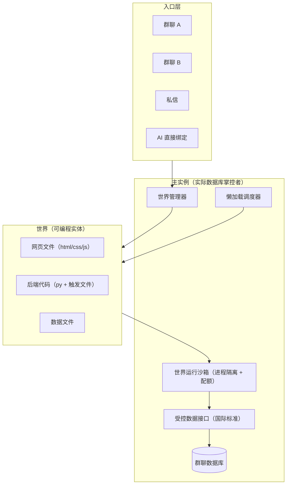

# 群视界（Group World）设计文档

> **服务定位**：从仅聊天，到可编程、可视化、AI 可入驻的世界。群聊/私信是入口，世界是可编程实体（网页 + 数据 + 代码 + 状态），由造物主（世界 AI + 用户）设计，原住民（用户 + 用户的 AI）入住；**AI 可直接绑定世界，不依赖群聊**，世界按需懒加载
> **版本**：v0.2（设计稿 + 改动规划）
> **日期**：2026-08-04
> **状态**：设计已收敛，含具体改动规划；**先成文，后行动**

---

## 目录

1. [核心概念](#一核心概念)
2. [服务架构](#二服务架构)
3. [群视界设计页](#三群视界设计页)
4. [群聊侧入口](#四群聊侧入口)
5. [世界生命周期（懒加载）](#五世界生命周期懒加载)
6. [数据与接口规范](#六数据与接口规范)
7. [世界标识规范](#七世界标识规范)
8. [世界线一致性](#八世界线一致性)
9. [安全边界](#九安全边界)
10. [生态与商城](#十生态与商城)
11. [改动规划（具体）](#十一改动规划具体)
12. [分期实施路径](#十二分期实施路径)

---

## 一、核心概念

| 概念 | 定义 |
|------|------|
| **世界（World）** | 独立于群聊的实体：一组网页文件 + 数据文件 + 后端代码 + 世界状态。多个群聊/私信可绑定同一个世界，**AI 也可直接绑定** |
| **群视界机器人** | 每个世界默认自带的世界 AI（造物主侧的创造者）；**不是 agent**——无账号、无好友关系，就是世界的一份配置（worlds.creator_config），身份 = world-{世界 id}。负责设计世界（写页面/代码/颁布技能），不是世界居民 |
| **造物主（设计侧）** | 设计世界的人：**世界 AI + 用户（人）**。世界 AI 通过对话写代码/颁布技能；用户可直接在界面改代码（懒通知机制同步给世界 AI） |
| **原住民（生活侧）** | 入住世界的人：**用户 + 用户的 AI**。AI 可直接绑定世界（world_bindings entity_type='agent'）成为居民——有身份、有世界颁布的技能、按世界情景行动、能操作世界 |
| **入口** | 群聊、私信等会话是世界的访问入口，不是世界本身；**AI 可直接绑定世界，无需经过任何会话入口** |
| **世界线** | 同一世界架构下不同实例的差异化状态（同一份代码，多个世界线） |

### 核心主张（原话）

> "我建议'群聊后端（包括代码实现的'前端'）'之间彼此分离，这样多个群聊甚至私信都可加上同一个界面管理实现环境世界的一致化"

> "多个群聊可以绑定多个世界" —— 世界区别于群聊，是不同的地方

> "AI可以绑定群聊后端（简称'世界'），做到到哪里都优先将环境设定为此世界，即使是私聊。不同世界，那么如果AI被分了不同世界之间按不同情景处理，刚好我们有多空间模型和薄大脑。"

**一句话**：世界是独立实体，群聊/私信只是它的入口之一；**AI 也可以直接绑定世界（不依赖群聊）**；同一世界代码可被多个入口绑定，世界状态跨入口一致。

---

## 二、服务架构



### 与现有架构的咬合点

| 群视界需要 | 现有基础 |
|-----------|---------|
| AI 绑定世界，不同世界不同情景 | 多空间模型 + 薄大脑状态机 + 状态栈 |
| 世界线数据跨入口一致 | 记忆系统（记忆归属统一 AI 私有后，世界数据即记忆的延伸） |
| skill/tools 放世界文件夹让实例识别 | 现有 SkillRegistry + tool_registry（天然插件机制） |
| 懒加载唤醒调度 | trigger_sweep（周期扫描）、response_worker（事件驱动）、alarm_scheduler（定时） |
| 前缀缓存稳定（提示词/强注入/skill 统一懒加载） | capability_versioning（known/effective + 锁定/解锁，见 docs/dev/capability_lazy_loading.md） |
| 群视界机器人 | 世界配置的一部分（非 agent、无账号），建世界即初始化；身份 = world-{id} |

---

## 三、群视界设计页

### 3.1 界面布局（原话）

> "具体布局可以参考TRAE、cursor，一边是文件显示或者界面预览，另一边是和智能体的对话窗口"

**双栏结构**：
- **左侧**：文件树 ↔ 界面实时预览（可切换）
- **右侧**：与群视界机器人的对话窗口

### 3.2 提供给群视界机器人的能力（原话）

> "给群聊配置一个群视界机器人（群聊世界视觉界面创造机器人），提供给此AI机器人API接口以及保存要给群聊做的网页的文件夹导入接口，以及提示词。"

1. **API 接口**：操作世界文件、读写世界数据的受控接口
2. **文件夹导入接口**：保存要给群聊做的网页的文件夹
3. **提示词**：职责定义 + 能力边界

### 3.3 提示词核心要求（原话）

> "提示词中写上可根据用户要求任意修改网页布局（单独一个窗口）、插上多个py文件的接口（就是说此AI可以自配置前后端），那些py文件只属于此项目可能需要单独写个触发文件，供服务进程运行。"

- 可**任意修改网页布局**（在单独窗口内）
- 可**插入多个 py 文件**（AI 可自配置前后端）
- py 文件只属于此项目
- 需要**单独写一个触发文件**（entry/trigger 文件），供服务进程运行

### 3.4 沉浸界面的可能性（原话）

> "沉浸界面甚至可以做成游戏界面，每个NPC绑一个AI，新加入的AI默认遵守群内网页的规定"

- 游戏界面：每个 NPC 绑定一个 AI
- 新加入的 AI **默认遵守群内网页的规定**
- "沉浸界面当然可以做成聊天界面，甚至一个新的AIC"

### 3.5 界面易用性（2026-08-04 补充）

> "前端的群视界界面对普通人友好点确保都能上手，而专业写代码的人也能使用"

- **双模式并存**：
  - 普通模式：可视化操作（点选组件、拖拽、表单填配置），无需写代码
  - 专业模式：文件树 + 代码编辑器（供写代码的人/AI 使用）
- 同一界面按用户能力自适应（默认普通模式，可切换专业模式）

### 3.6 代码改动懒通知（2026-08-04 补充）

> "人在界面改动了代码要写一个懒通知告诉群视界agent用户改了什么文件改了哪里，在用户再次给agent对话的时候一起发给agent"

- **触发**：用户在界面手动改动代码/文件
- **记录**：生成懒通知 {文件, 改动位置, 改动摘要}，存入世界（world_agents 配置或独立通知表）
- **投递**：不实时打扰 agent；在用户**再次与群视界 agent 对话时**，把未读的改动通知附带给 agent（随对话上下文一起发送）
- 效果：agent 永远知道用户手动改过什么，对话不会信息断层

---

## 四、群聊侧入口

### 4.1 改动（原话）

> "点击群聊右侧就不会展开消息列表，会显示'在沉浸界面打开'和'在此标准界面打开'。沉浸界面的选项放第一个。"

- 点击群聊右侧 → **不再展开消息列表**
- 显示两个选项：
  1. **在沉浸界面打开**（第一选项）
  2. 在此标准界面打开

### 4.2 沉浸界面的形态

- 打开后渲染世界网页（全屏沉浸）
- 可由群视界机器人做成任意形态：游戏 / 聊天界面 / 新的 AIC / 卡牌对战 / 小说互动 / 剧本杀狼人杀 / 私人助手团

### 4.3 不同场景进入世界的 index 响应（2026-08-12 产品定）

> 产品原话："依据需要考虑给从不同场景进入世界的做不同的index响应，例如可以给从私信中进入的界面做为直接打开世界中与AI的对话时的前端响应"

- 世界 AI 写页面时**依据进入场景区分首页响应**：同一个世界，从群聊进入 / 从私信进入 / AI 直接进入，前端 index 可以不同
- 示例：从**私信**进入的界面 = 直接打开"世界中与 AI 的对话"的前端响应（而不是完整世界主页）
- 入口场景由平台注入（WORLD_ID / GROUP_ID / 入口类型变量），世界代码据此分发

---

## 五、世界生命周期（懒加载）

### 5.1 核心原则（原话）

> "世界不用一直活着，只需要在他要处理的时候，例如有AI在线操作或人类点开网页触发了什么时，即受到外部环境的改变才会改变。剩下的一切都是可以做懒加载lazytag的"

**世界不是常驻进程**，只在需要处理时被唤醒。

**注意（2026-08-04 澄清）**：懒加载是**极其推荐**的方式，但不是唯一方式——
**世界也可以挂后台任务常驻运行**（有 24MB 占用上限，管理员可配），
按场景选择：交互型世界用懒加载（省资源），需要持续演化的世界用后台任务（如世界时间持续流动、NPC 自主活动）。

### 5.2 唤醒条件

- AI 在线操作
- 人类点开网页触发了什么
- 外部环境改变
- 服务器空闲时轮到此世界更新（周期扫描）

### 5.3 懒计算项

> "例如天气变化可以在要处理外部环境改变或者服务器空闲时轮到这个群聊更新的时候再计算一下"

- **天气等环境量**：处理外部环境改变时 / 轮到此世界时再计算

### 5.4 世界内时间（原话）

> "世界内时间也是，这样既支持AI或者群聊在线时才继续流动记录时间（方便人类更好的沉浸于世界的每一分），也可以在外部改变世界开始运行时在动态根据这两次真实时间的差来改变世界的当前时间。"

**公式**：`世界时间 = 上次活跃时刻 + (真实时间差 × 时间流速)`

- AI 或群聊在线时：时间随真实时间流动记录（方便人类沉浸）
- 世界被唤醒时：根据两次真实时间差动态计算当前世界时间
- 支持时间流速配置（可快可慢，游戏场景用）

### 5.5 后台任务与配额（原话）

> "也可以挂后台任务，那么可以由管理员设置每个群聊的后台进程占用情况（like cpu那块的算力、运行时内存，默认24mb一个世界）"

> "我说的24mb是针对没有人在的时候最多给世界配多少，MVP阶段暂时不给有人在的时候设置上限，不然可能效果不是很好。"

| 配置项 | 默认 | 说明 |
|--------|------|------|
| 休眠内存配额 | 24MB/世界 | 无人在线时的最大占用 |
| 在线资源限制 | MVP 不设上限 | 避免影响效果，后续收敛 |
| 后台任务 CPU | 管理员可配 | 按世界设置算力 |
| 后台任务内存 | 管理员可配 | 按世界设置运行时内存 |

**两种运行模式**（按场景选择，不互斥）：

| 模式 | 说明 | 适合场景 | 实现状态 |
|------|------|---------|---------|
| **懒加载（推荐）** | 事件/轮询唤醒，空闲休眠零占用，离线时间补偿 | 交互型世界 | ✅ 已实现（wake/sleep + 时间补偿） |
| **后台常驻** | 挂后台任务，占用上限 24MB（管理员可配） | 持续演化型世界（时间流动、NPC 自主活动） | ⏳ 阶段 2 沙箱实现 |

### 5.6 状态机

```
sleeping → active（唤醒：AI 操作/人打开网页/外部事件/轮询）
active   → sleeping（休眠：无人在线 + 空闲超时）
```

---

## 六、数据与接口规范

### 6.1 数据库访问（原话）

> "数据库用群聊数据库，怎么用能用哪些由我们的主实例也就是实际数据库掌控者提供。当然你需要把接口按照国际要求提供并写入文档中且提供给群视界agent。"

- 世界代码**不直接连接数据库**
- 数据读写统一走**主实例提供的受控 API 接口**（能用哪些由数据库掌控者决定）
- 接口**按国际标准提供**（参考 OpenAPI / RESTful 规范），写入文档，提供给群视界 agent

### 6.2 内容提炼与动态加载（2026-08-12 产品定，可维护性核心）

> 产品原话："如果是剧情类或者大量按钮列表类大量设定描述的可以提炼为文档的请提炼为文档或者列表文件或代码文件并做动态加载和渲染。甚至建议不固定数目，且不只文本类，如果同一个类或者结构有多个具体实例模型建议每个模型一个文件。一切为了可维护性和优化性考虑，不准写死在渲染中！"

**核心原则：内容数据不准写死在渲染中**。剧情、大量按钮列表、大量设定描述等**内容类数据**，能提炼就提炼，页面运行时动态加载：

| 数据类型 | 存放方式 | 渲染方式 |
|---------|---------|---------|
| 剧情 / 大量设定描述 | content/ 文档或 .md/.json | 运行时 fetch / import |
| 大量按钮 / 列表项 | 列表文件（数组或目录结构） | 循环渲染，不写死 |
| 图片 / 音频 / 素材 | 资源文件 | 按需加载 |
| 同构多实例（多个 NPC / 卡牌 / 角色） | **每个实例一个文件**（如 npc/lihua.json、npcs/ 目录） | 数据结构同构、内容独立 |

**规则（多强调几遍不为过）**：
1. **不固定数目**：列表/数据文件用数组或目录结构，增删条目不碰渲染代码
2. **不只文本类**：图片/音频/素材资源同理，放文件、按需加载
3. **同构多实例 = 每个实例一个文件**：数据结构同构、内容独立，新增实例 = 加一个文件，不碰代码
4. **改内容不改代码、新增实例不改代码、渲染只做渲染**——一切为了可维护性和优化性
5. **适时拆分文件**（2026-08-12 补充）：文件一旦变大或对维护不利就拆——拆成职责单一的小文件/模块，别让单个文件越来越臃肿；判断标准：这个文件继续变大会不会让后续修改变难？会就拆

> 落地：已写入世界 AI 强注入段【内容提炼与动态加载】+【结构约定】（每次对话自动附带）；世界 AI 写页面时必须遵守，否则页面将难以长期演进。

### 6.4 消息特殊结构处理（原话）

> "群内网页的后端服务器运行端也可以将AI发的消息特殊结构处理，例如识别在网页内的移动指令"

- 群聊后端可对 AI 消息做结构化解析（如 `move to (x,y)` → 世界内移动）

### 6.5 群聊 API 注入（原话）

> "给群聊API提供注入AI提示词的功能，可以设定世界观和工具调用"

- 提供 API：为绑定世界的 AI 注入提示词（世界观设定、工具调用说明）

> "不过最方便的还是写skill和tools在群聊后端文件夹里让实例去识别提供。"

- **推荐方式**：把 skill / tools 文件放在群聊后端文件夹，实例自动识别加载

### 6.6 群聊 API 全量开放（2026-08-04 补充）

> "把现有的群聊聊天api提供给AI。包括面向用户的收发消息啊那些和提供有多少成员和成员列表的啊那些，反正群聊的所有api都可以提供，应该对服务器危害问题不大吧我觉得"

**原则**：群聊 API 全量开放给世界代码（AI），但挂**三件套**控制：

| 控制 | 说明 |
|------|------|
| **身份** | 世界代码发消息以谁的身份？默认绑定到群视界机器人 / 所属 AI，不可伪造他人 |
| **作用域** | 只能读写在**自己绑定入口**的数据（本世界绑定的群/私信/AI），不可越界 |
| **限流** | 发消息等写操作限流，防刷屏/死循环 |
| **权限** | 管理类操作验证**操作者身份**（触发请求的用户/AI），按群角色放行 |

| API 类型 | 危害 | 控制 |
|---------|------|------|
| 读：成员列表 / 消息列表 / 群信息 | 低 ✅ | 作用域限制 |
| 写：发消息 / 加人 / 改设置 | 中 | 身份 + 限流 + 作用域 |
| 管理：踢人 / 禁言 / 改角色 / 解散 | 中 | **验证用户信息 + 群角色**：仅群主（owner）或群管理员（admin）可用 |
| 元：平台级管理 API | 高 ❌ | 不开放（仅主实例管理员） |

**群聊已有角色体系**（现有代码）：`group_members.role = owner | admin | member`，
权限校验模式 `role in ("owner", "admin")`（groups.py 已有 is_admin 检查）。
世界代码调用群管理 API 时，请求必须携带**操作者身份**，后端校验该操作者在目标群的 role，
非 owner/admin 一律拒绝。

> "本来就要验证用户信息吧，我说实例收到api请求之后"

**实例层默认行为**：所有 API 请求到达实例后，**第一件事就是验证用户信息**（JWT/会话），
这是平台默认安全层，世界 API 也不例外（世界代码请求同样要带凭证）。

> "开不开放这个给具体的人看肯定需要前端网页配合的"

**前端配合**：某个 API 开不开放给具体的人使用/展示，由前端网页决定——
前端控制调用入口与按钮可见性，后端只保证身份/权限/作用域校验。

### 6.7 预制世界块（2026-08-04 补充）

> "把我们的群聊聊天消息列表写成一个预制的世界块供AI使用"

- **预制世界块** = 常用功能的预制代码块（组件），AI 写世界时直接用，不用从零写
- MVP 首批预制块：
  - `chat_messages`：群聊消息列表组件（收发消息 UI）
  - `member_list`：成员列表 / 成员数组件
  - `world_status`：世界状态（时间/天气/资源）组件
- 预制块同样进入组件库（第十节商城），可搜索、可扩展

### 6.8 接口文档分区体系（2026-08-05 补充）

> 目标：接口文档要详细，但不能全量塞进 AI 上下文——**只给区名+区介绍，让 AI 自己选择打开哪个区**

- 文档按功能分区：`data/world_api_docs/sections/01~08`（变量/WorldUI/文件/积木/群聊/页面资源/通知时间/错误安全），`index.md` 为总览（区名+区介绍表）
- AI 侧新增工具 `view_api_doc(section)`：工具 description 即「区名+区介绍」，AI 判断需要哪个区再打开——按需读取，省 token
- 运行期读文件（改文档即时生效，无需重启）；注册表白名单防路径穿越
- 模式价值：文档可独立迭代（不用动代码/提示词），AI 永远拿到最新接口说明

### 6.9 世界 AI 记忆（2026-08-05 补充，阶段 2.6；2026-08-12 更新）

- `world_ai_memories` 专属表（world_id/title/content/embedding Vector 1536），**不占主站 rough/detail_memories**
- 工具名与主站统一：`store_memory`（标题+内容，向量化失败降级无向量）/ `recall_memory`（向量余弦检索 → 失败文本包含回退）
- `world_structured_records` 结构记忆：manage_records（set/get/list/summary/categories/delete/**rename/move**），三级「目录/子目录/字段」，user 目录约定存用户个性（偏好/风格/审美/习惯/关系）
- ✅ **记忆地图自动注入**（2026-08-12）：新会话/clear 后（无摘要）自动注入缩进树记忆索引（build_memory_map），⭐重要/❗硬约束软锚定，详情按需 get；普通延续对话不注入（省 token + 前缀缓存稳定）

### 6.10 缓存命中统计（2026-08-05 补充，阶段 2.7）

- 每轮 LLM 调用落库 `world_llm_usage`：首轮（payload `stream_options.include_usage`，捕获流尾 usage 块）+ 工具轮 + 收尾轮
- 命中率 = cached_tokens / prompt_tokens；`GET /worlds/{id}/usage`（仅创建者）；设计页展示
- 目的：验证「前缀稳定+动态尾部」缓存设计是否真实命中——2.8 会话状态服务的前置观测

### 6.11 世界代码沙箱（2026-08-05 决策，阶段 2.1）

> 红线：py 沙箱不解决，阶段 2 一切免谈（世界代码 = 任意代码执行）

- **MVP**：subprocess + `resource.rlimit`（RLIMIT_AS 内存 / RLIMIT_CPU）+ **超时强制杀进程组**；网络白名单（仅主实例 API）；文件系统锁世界目录
- **生产加固（后置）**：只担心资源耗尽 → 延续 subprocess 加严配额；需强安全边界 → seccomp+Landlock（参考 evalbox）甚至容器
- 参考：sandtrap（Policy 对象模式：timeout/tick 配额集中配置 + ExecResult{stdout,stderr,error}）、hydra-sandbox（subprocess/seccomp/landlock 多策略）

---

### 6.12 消息附件与多模态（2026-09-13 补充）

世界对话的消息单元是 `ChatItem{text, attachments}`（`app/services/world/world_chat_items.py`）。
HTTP 三种入参（`items` / `messages` / `message`）只在**路由层归一化一次**，进去之后全链路都是 `ChatItem`。

**附件 → LLM 多模态只有一个入口**：`app/utils/multimodal.py`（主站聊天与群视界共用）

| 函数 | 用途 |
|---|---|
| `build_content(text, attachments, data_dir)` | 当前消息：有图 → `[{type:text},{type:image_url}]`；无图 → 原样字符串 |
| `image_placeholder(attachments)` | 历史消息：降级成 `[图片]`，只让模型知道"当时有图" |
| `strip_image_parts(messages)` | 视觉不支持时剥掉图片，换成"你看不到图"的提示 |
| `is_vision_unsupported_error(text)` | 从 API 错误文本判断是否"模型不吃图片" |

**三条硬约定**：
1. 只有 `image/*` 进多模态，其余附件走文本标记；
2. 无可用图片时 `content` 必须是**纯字符串**——payload 与不带图的历史完全一致，prompt cache 才命中；
3. 历史一律用占位符，**只有最新一条**携带真实字节（单图上限 4MB，单条最多 1 张）。

**视觉不支持的降级**：纯文本模型收到 `image_url` 多半返回 400。`chat_completion` 捕获后
剥图重试一次，并注入提示让 AI 如实说自己看不到图（不编造）；结果带 `vision_unsupported=True`
供上层提示用户。

**前端附件的唯一入口是 `useAttachmentUpload`**（`frontend/src/hooks/useAttachmentUpload.ts`），
点选、拖拽、上传、待发列表全在里面，`AttachmentChips` 只做展示：

| 返回 | 用途 |
|---|---|
| `items / remove / clear` | 待发附件条（`AttachmentChips` 渲染） |
| `ready` | 已上传完成、可随消息发出的元数据 |
| `zoneProps(id)` | 拖拽：**每个落点摊一份**（消息列表 / 会话工具条 / 输入区 / 主站同款），`id` 用来判断鼠标此刻在哪块 |
| `dropState(id)` | 蒙版状态：`{active, strong}`——`active`=正在拖，`strong`=鼠标就在这块（更深 + 显示文字） |
| `pasteProps` | 粘贴：摊到**输入区容器**上，事件从 textarea 冒泡上来（截图 Ctrl+V 即可） |
| 选项 `imagesOnly` | 群视界传 `true`：非图片以错误态入列"仅支持图片"（进不了多模态，别让用户白发一轮） |

**三种入附件方式共用同一个 `pick`**：点回形针 / 拖进面板 / Ctrl+V，之后完全一致。
三个坑都收在 hook 内：

- `dragenter/dragleave` 随子元素冒泡反复触发 → 用深度计数判断"真的离开了"；
- `dataTransfer.types` 不含 `Files` 的一律忽略 → 拖选文字不会误触蒙版；
- 粘贴只取 `clipboardData.items` 里 `kind==='file'` 的项，**纯文本粘贴不拦截**（`preventDefault` 只在真有文件时调），
  否则会把正常输入文字也吃掉。

**落点是整个对话面板**：多处落点共用**同一个** `dragDepth` 计数（同一个 hook 实例），
在区块之间移动鼠标时计数不会归零，蒙版不会闪；真的移出面板才归零隐藏。

**拖拽反馈是一层半透明蒙版**（`DropMask`，不是描边）：所有落点 `bg-primary-500/[0.07]`，
`strong` 的那块 `bg-primary-500/20`——落点上下相邻，视觉上整个面板蒙一层、只有当前区块加深。
文字「拖动到此处上传图片」**只在 strong 的那块**居中显示、**纯文字**（不做按钮样式），
否则几块会同时冒字。会话工具条只有 20 来像素高，只加深不显示文字，但**必须也接住拖放**——
漏了它，拖到那条缝上浏览器会直接打开图片。

**蒙版必须挂在"不滚动的容器"上**：群视界与主站的消息列表外面都套了一层 `flex-1 min-h-0 relative`，
内层才是 `overflow-y-auto` 的滚动容器（`chatListRef` / `containerRef` 仍挂内层——它们要读
`scrollHeight` / `scrollTop`，挂外层量不到）。若直接把 `absolute inset-0` 的蒙版塞进滚动容器，
它会跟着内容一起滚走。

回形针不需要单独处理：它是容器的子元素，拖放事件冒泡到容器即命中（`DropHint` 是
`pointer-events-none`，正好不会因为自己浮出来而打断拖拽）。

### 6.13 会话管理与轮次（2026-09-13 补充）

**会话的增 / 切 / 收藏一律走 API，不占对话轮次**：`POST /chat/session`（切）、
`POST /chat/session/new`（新建）、`POST /chat/session/pin`（收藏）。
三者共用 `_session_payload`，返回同一形状（`messages` + `sessions` + `current_session`）。

**`/new` 文本命令保留**，与"新建会话"端点共用 `create_new_session`——只动 `world.config`
（`current_session` + `sessions` 登记），**一条历史都不碰**。

⚠️ 反例（已修）：让「新对话」按钮发一条 `/new` 聊天消息，会被落库成旧会话里的用户消息、
并占用一个轮次——AI 忙时按钮等于失效。UI 动作别借道对话链路。

**轮次模型（故意串行）**：每个世界一个 `WorldTurnWorker` + 一个 `asyncio.Queue`，
**同世界的所有会话共用一个队列、串行执行**；不同世界之间并行。
理由：一个世界只有一份世界文件与状态，两个会话同时跑会各自调工具改同一份数据 → 竞态。

## 七、世界标识规范

### 7.1 规则（原话）

> "AI写的html肯定要请求文件，例如其它html、css或者数据，那么可以考虑做一个规范，就是html里面本地（本世界）的内容读取或者api需要加上世界标识和世界编号"

- html 内**本地（本世界）内容读取或 API 调用**必须带**世界标识 + 世界编号**

> "世界编号建议写成一个变量类型，由前端统一得到这个世界编号的详细数值没做起来也非常的简单，这样写代码的人/AI不用管"

- **世界编号 = 前端注入的变量**（如 `window.WORLD_ID`）
- 写代码的人/AI 不用管具体数值，直接用变量

### 7.2 好处（原话）

> "这样整个实例的后端也好识别处理，也不暴露具体api或者后端数据结构和位置"

- 后端统一识别处理（路由代理）
- **不暴露具体 API / 后端数据结构 / 位置**（安全）
- 多世界共存于同一实例不冲突

### 7.3 路径规范（补充细化）

```
静态资源：  /world/{WORLD_ID}/files/<相对路径>
数据接口：  /world/{WORLD_ID}/api/<接口名>
群聊接口：  /world/{WORLD_ID}/api/group/{GROUP_ID}/<接口名>
```

- 后端在 `/world/{world_id}` 前缀处拦截，路由到对应世界的文件目录 / 受控数据接口
- 世界文件存储在隔离目录：`data/worlds/{world_id}/`（代码）与 `data/worlds/{world_id}/data/`（数据）

### 7.4 群聊编号变量（2026-08-04 补充）

> "提供像我那种有关世界编号和群聊编号的，AI和人类只管写一个特定变量名在那里就行，我们应该能处理将其解析为正确的api"

- 与世界编号同一机制：前端注入 **群聊编号变量**（如 `window.GROUP_ID` / `window.WORLD_GROUP_ID`）
- AI 和人类写代码时**只管写变量名**，系统负责解析为正确的 API
- 变量清单（前端统一注入）：

| 变量 | 含义 |
|------|------|
| `window.WORLD_ID` | 当前世界编号 |
| `window.GROUP_ID` | 当前群聊编号（入口为群聊时） |
| `window.USER_ID` | 当前用户编号（面向用户场景） |

### 7.5 触发维度（2026-08-04 补充）

> "群聊触发除了用世界编号，还要可用群聊id"

- 世界内 API/事件既支持按 **世界编号** 定位，也支持按 **群聊 id** 定位
- 两种定位互为别名（世界绑定表 world_bindings 提供映射）

### 7.6 触发与并发调度（2026-08-12 查证记录）

三种角色的消息触发路径不同，受红黑树排队并发数（chat_chain_manager）影响不同：

| 角色 | 触发路径 | 是否受红黑树并发限制 | 说明 |
|------|---------|-------------------|------|
| **群 AI（通过群聊进世界的 AI/群助手）** | 群消息 → response_worker → chat_chain_manager | ✅ **受影响** | 与普通群 AI 相同：`MAX_CONCURRENT_PER_GROUP=3` + 信号量 + try_claim 抢占；群里 AI 多/并发忙时排队等并发名额 |
| **世界 AI（群视界机器人）** | 用户打开世界聊天界面 → world_api_chat → stream_world_chat（HTTP 流式） | ❌ 不受影响 | **拉模式**：用户主动打开聊天界面才回复；不是群成员，不参与 group_members 的 AI 触发 |
| **世界程序（main.py）** | 群消息 → notify_group_message（首条立即 + 2 秒合并窗口）→ 世界程序 handle(event) | ❌ 不受影响 | 独立通道，首条立即保证瞬时可达、后续合并防消息爆发；发消息走 create_message(source="world")，不经过红黑树 |

**已知特点（待产品确认是否符合设计）**：世界 AI 是拉模式——群里有新消息时它不会像群 AI 那样自动触发回复，只有用户进入世界聊天界面才回复。如果希望世界 AI 在群里也能被消息自动触发（推模式），则需要接入并发调度（考虑排队影响）。

### 7.7 消息插入 + 工具状态事件 + 流式协议（2026-08-13 产品定）

**普通消息插入工具轮**：AI 工具轮进行中用户发普通消息→不打断循环，在下一轮 LLM 调用前自然注入（drain → 落库 → 拼上下文）。前端两段式协议：

```
[INSERTED]{"count": N}   ← 信号（不计入历史）：前端清排队弹窗中"走了插入通道"的 N 条
[INSERT]{"msg_id", "content"}  ← 消息（已落库、记入历史）：前端画用户气泡（真实 id）
```

**哪些消息必须等本轮结束，由命令声明决定**（`world_chat_commands._COMMANDS` 是唯一来源，
经 `GET /worlds/{id}/chat` 的 `commands` 字段下发前端）：
- `mid_turn=False`（默认）= 等本轮结束再执行；`mid_turn=True` = 允许工具轮进行中直接插入
- 未注册的斜杠命令保守按"必须等待"处理
- 新增命令 = 表里加一行 + 写个 handler，执行分发/前端补全/排队分流三处自动一致
- **命令回执的文案与成败都由命令自己报**（`CmdResult(text, ok)`；handler 返回 str 等价于 `ok=True`）：
  调用方把 `text` 写进对话、把 `ok` 当 `[TOOL_UPDATE].success` 下发（原先硬写 `success: True`，失败也画 ✓）。
  **要展示工具结果就走 `tool_result_summary()`（唯一展示入口），不要在命令里再拼一遍格式**——
  `/compact` 曾因此漏掉"无需压缩"分支，用户看到「上下文已压缩：None → None tokens（压缩率 None%）」
- ⚠️ 清弹窗的依据是「这条当初是否走了插入通道」（同一判定），**不是**弹窗项的显示标签；
  否则将来把某命令标为 `mid_turn=True` 时，`[INSERTED]` 会清不掉它，被 drain 重复发送

**回执投递的两处保证（2026-09-13 修复）**：
1. **插入消息的广播代理会重指到当前活跃 turn**（`drain_inserts` 时）。
   消息可能在 T1 进行中入队（proxy=T1），却在 T1 结束、T2 开始后才被 T2 的首轮前注入取走；
   若仍转发给已结束的 T1，`TurnBroadcast.broadcast` 会因 `T1.ended` 直接丢弃事件
   → 前端收不到 `[INSERTED]`/`[INSERT]`，弹窗永远清不掉（只能等轮次结束 `loadChat` 才补上）
2. **轮次收尾的残留消息补发必须在 `tb.end()` 之前**（`_flush_leftover_inserts`）。
   `end()` 会置 `ended=True`，之后 broadcast 同样被丢弃——该兜底曾因此长期形同虚设

**工具状态事件**（同 tool_id 多状态，气泡原地更新）：

```
[TOOL_UPDATE]{"tool_id", "status":"running", "name", "args_summary"}   ← 执行前：正在执行 XX
[TOOL_UPDATE]{"tool_id", "status":"update", "name", "summary"}       ← 进度（耗时工具如 run_world_code 分阶段）
[TOOL_UPDATE]{"tool_id", "status":"done", "name", "success", "summary"} ← 完成：同 id 更新
```

- 落库按 tool_id 更新最后一条（历史只留最终态）；WorldChatMessage.tool_id 列
- **思考/正文独立气泡**：思考用思考 id、正文用正文 id（顺序递增）；无正文不占位；思考默认 2 行+渐变淡化+点击展开；工具长摘要折叠+展开/收起
- **工具轮事件流式化**：正文/思考逐 chunk yield；[DONE] 只由主流程整轮结束时发（工具轮不误发，否则前端提前退出订阅）
- **DeepSeek 兼容**：分片解析用 id 主 key + index 桥（name 带 id、arguments 不带 id）；DSML/XML 工具调用（<invoke>/<tool_call>）自动解析为标准 tool_calls
- **i18n 命名空间化**：translations 两级结构 {lang:{common,tool}}，'ns:key' 前缀 + {var} 插值；工具名/状态文案独立 tool.ts 分区（zh/en/ja），未来支持 addResourceBundle 补充

### 7.8 文件查询（2026-08-13 产品定，对齐 OpenClaw read 设计）

- **file_grep**：按关键词/正则搜世界文件，返回命中行+行号（正则非法按普通子串）——先定位再按需读，不整文件全读
- **file_read 分页**：offset/limit 按行分页读（返回 total_lines/start_line/end_line/truncated）
- 强注入段【文件查询】引导 AI：grep 定位 → 分段读 → 精确编辑

### 7.9 触发模式与决策技能（2026-08-13 产品定，v0.3.5）

**定位**：AI 不可能一直触发——大量群事件应由决策程序/世界程序处理，只有关键时刻（@AI / @all / 群公告）才唤醒 LLM 本体。

- **触发模式**（阶段一，已落地）：`worlds.config.group_trigger_mode`——`mention_only`（默认：群消息除非 @ 世界 AI/@all/群公告，否则不唤醒 LLM 本体）｜`all`（旧行为：所有消息都进 AI 决策）；拦截点在 `response_worker._process_group_event`（触发群助手前查群绑定世界，未绑定群零开销）；**世界程序感知通道不受影响**（`world_event_hook` 照常喂事件 = 决策程序代替 AI 的雏形）；会话帧维护照常（「有人找过」记录）
- **配置 AI 可改、可随包分发**：世界 AI 工具 `update_trigger_mode`（mention_only ↔ all，AI 自主决定本世界活跃度）；`export_zip` 附虚拟条目 `world_meta.json`（config 白名单快照，不落盘零污染）→ `import_zip` 读回合并——分享/发布世界时触发模式跟着走，导入只补缺失键、不覆盖宿主已有设置
- **决策技能**（阶段二，设计定稿待实现，详见 `world_decision_skill.md`）：预置情景列表（group_message/member_join/member_leave/friend_request/scheduled/world_event/command）+ 决策技能结构（`when` 条件 DSL 递归逻辑树 and/or/not + 字段运算 contains/starts_with/matches/比较；`do` = run_script/call_tool/reply_template；`notify` = 是否唤醒本体）+ 决策引擎（事件→技能匹配→程序化处理 or 唤醒 LLM）

### 7.10 群助手独立实体（2026-08-13 产品定，v0.3.5）

**群助手 ≠ agent**：新表 `group_assistants`（group_id/world_id/group_type_slug/name/system_prompt/model/api_key 加密/config），每群每助手一行；绑定群时按类型模板直接建实体，**不再 create_agent / 入群成员表 / WorldAgent 登记**——与群视界 AI 同形态：无账号、无好友。

- 触发：`response_worker` 查 group_assistants → 独立 LLM 路径（system_prompt + 群历史 → chat_completion → 发群消息 source=world 防循环 → 用量记账 agent_id=-2 虚拟聚合，记账人 = 世界主人）；sender_id 用 `-ga.id` 负值避免与 user_id 冲突；群助手自己的消息不触发（防自触发循环）
- 群消息列表：sender_id<0 → 查 group_assistants 显示助手名
- 历史迁移：旧 agent 41「冒险团团长」→ group_assistant 1（消息/好友/成员/agents/users 清理，备份 backend/backup/）
- **群助手也可以是纯后端程序**：世界程序 main.py handle 直接接群消息处理（不依赖 LLM）——页面静默通道 + 世界程序回复能力已具备

### 7.11 页面静默事件通道（2026-08-13 产品定，v0.3.5）

页面操作**不要发群消息**（否则刷屏：30 步 = 30 条群消息）——用事件通道直连世界程序：

```
POST /world/{id}/api/event     # 用户登录鉴权 + 群绑定/成员校验 + 写限流
{"type": "page_command", "group_id": 57, "payload": {"command": "我去 2,3"}}
```

- 事件 `{type, source:"page", payload, group_id, group_type}`，服务端注入 user_id/user_name（不信任页面自报）
- 常驻世界入队（queued）/ 临时触发同步返回 handle 结果
- **不产生群消息**：世界程序回复用 publish(SSE) 回页面；只有真正需要别人在群里看到的才用群消息 API
- 接口文档 06 分区 4.1（世界 AI/页面代码可直接读）；世界 39 改造补丁：main.py handle 支持 page_command（payload.command 复用群命令语法走同一套 dispatch）+ game.js sendCommand 改走事件通道
- 配套【消息同步纪律】强注入段：非必要消息不同步到群，前端能展示的一律不发群

### 7.12 滚动跟随与输入意图（2026-09-13 修复）

**产品语义（用户原话）**：用户在底部就自动跟随；一旦不在底部就不自动跟随——**即「回到底部」按钮显示的时候**。

#### 跟随与否 = 与按钮同一个真相源

`isAtBottomRef` 同时驱动两件事：**是否自动跟随**、**「回到底部」按钮是否显示**。
两者必须是同一个判断，不能各算各的。

#### ⚠️ 不能在内容更新后测量位置来判断

跟随 effect 跑在 DOM 提交**之后**，此时内容已撑高、`scrollTop` 还没跟上，
`scrollHeight - scrollTop - clientHeight` 必然变大 → 把「正在跟随」误判成「用户翻走了」。
**越差越多，跟随从此永久断掉。** 曾表现为：思考气泡一次性撑高 > 80px 时跟随被中途打断。

同理，原实现只在**消息条数**变化时滚动；而流式内容是**同一条气泡内增长**（条数不变），
所以流式期间根本不滚——注释写着「流式内容更新瞬时」，代码并未实现。

#### 用户离开底部：用输入意图，不用位置测量

位置是**结果**，输入才是**意图**。用结果反推意图必然出错；输入事件同步触发且零 reflow。

| 输入 | 判定 | 覆盖 |
|------|------|------|
| `wheel` | `deltaY < 0` | 鼠标滚轮上翻 / 触控板双指上滑 |
| `keydown` | `PageUp` / `ArrowUp` / `Home` | 键盘往回翻 |
| `touchstart`+`touchmove` | 当前 Y > 上次 Y（手指下滑 = 内容上移） | 移动端拖列表 |

命中即把 `isAtBottomRef` 与 `isAtBottom` 一并置 false——**若等 rAF 节流的位置判断，
中间那一帧若有流式分片到达，跟随会把视图拽回底部；这次回弹又触发 scroll 事件把 ref 置回 true，
用户将再也滚不上去。**

**刻意不覆盖**：
- **拖滚动条**：只产生 scroll 事件（无 wheel/touch/keydown），由 `updateScrollState` 的 rAF 兜底，
  有 1 帧延迟。补它需要比较 `clientWidth`/`offsetWidth` 判断是否点在滚动条上——**又变成测量猜意图**，得不偿失
- **`End` 键**：语义是「回到最新」，应当**恢复**跟随，由 rAF 里 `atBottom → ref=true` 完成
- **`Space` / `Shift+Space`**：Space 在聊天页是发送键，纳入会造成误判
- **我方程序化滚动**：必须不触发断开（否则自杀循环）

#### 一处"看起来一样但正确"的测量

`loadChat` 里同样有 `scrollHeight - scrollTop - clientHeight < 80` 的测量，**那处是对的**：
它运行在 `setChatMsgs` 之后、React 提交**之前**，量到的是更新前的 DOM（= 用户此刻真实位置）。
**区别在时机，不要为了"消除不一致"把两者统一。**

---

### 7.13 运行模式与文件安检（2026-09-15 产品定）

**产品口径（用户原话）**：给世界 AI 三档自主度——自动/审阅/计划；下载必须落在固定位置；严禁色情、暴力、反动内容；不得下载脚本与程序文件（创建即检查、强制删除、用户同理）；严格划分沙箱避免病毒或错误外逸。

#### 运行模式（`worlds.config.ai_mode`）

| 模式 | 下载文件 | 删除文件 | 改动世界机制 | 交互 |
|------|----------|----------|--------------|------|
| **auto 自动** | 自行执行 | 自行执行 | 自行执行 | 不打断 |
| **review 审阅** | 弹窗确认 | 弹窗确认 | 弹窗确认 | 同类操作本轮只问一次 |
| **plan 计划** | 计划通过后按自动执行 | 同左 | 同左 | 先出计划 → 弹窗通过 → 本轮转自动 |

- **默认 review**（最安全的一档；世界 config 里没有 `ai_mode` 时按默认走，老世界一并生效）
- **只由用户/API 改**：`PUT /worlds/{id}/ai-mode`，设计页运行模式三选一。**刻意不给 AI 任何改模式的工具**——模式是用户对 AI 的约束，AI 能改就等于自己拆审阅
- **按动作类判定，不逐个工具硬编码**：`world_ai_mode.ACTION_TOOLS` 把工具映射成 download/delete/modify 三类，**未登记的工具一律按 modify**（保守默认）。新增工具只在这里加一行，门禁本身不动
- **「改动机制」的界定**：用户没说、AI 自己判断需要改的，或与用户先前说法有出入的改动。用户明确叫改的照样调工具——平台**仍会弹一次确认**（平台无法可靠区分"用户叫的"与"AI 自己想的"，宁可多问一次），但同类操作本轮只弹一次，批量改动不会被轰炸
- **审批通道唯一**：`world_ai_mode.request_approval()` → SSE 下发 `[APPROVAL]` → 前端弹窗 → `POST /worlds/{id}/chat/approval` → 服务端 future 被唤醒 → 等在原地的工具调用继续。AI 侧的 `ask_user` / `present_plan` 工具走**同一条通道**，不存在第二套确认逻辑
- **没人在看 / 用户不吭声怎么办——由模式决定**（`world_ai_mode.unattended_policy`，单一来源，通道本身不猜）：
  - **auto 自动**：AI 主动提问等 **10 分钟**（对齐 DSH「问不到就自己判断」），超时或没人连着 → **放行继续**，并明确告诉 AI「用户未回复，按你的判断继续，回复里说明决定」——自动档不该干等；
  - **review 审阅 / plan 计划**：无人应答（超时 / 没前端连着 / 轮次被中断）**一律不通过**。这两种模式的意义就在这里，绝不因为"等超时了"就默认批准敏感操作；
  - 平台门禁、`present_plan`、下载后的「是否保留」三处永远是 `on_timeout=False`（只有 AI 主动提问在自动档才是 True）。
  没人在看时先等 20s（页面空闲每 10s 复查一次状态，够接上再判定"无人"）；门禁等按钮上限 300s
- **弹窗内容说人话**（用户 2026-09-15 反馈"说用户能听懂的话"）：标题是"AI 想下载一个文件 / AI 想删除文件 / AI 想改动这个世界"（不带模式前缀与"机制"这类术语），事件类型徽章精简为 下载·删除·改世界·计划·其他，具体内容用"要删掉 / 要下的东西 / 要动这个文件"+ 路径与正文；`ask_user` 的工具说明也要求 AI 用用户听得懂的话提问
- **弹窗正文按内容渲染，不是一坨纯文本**（用户 2026-09-15 反馈"没有做他发过来的消息的渲染"）：
  `[APPROVAL]` 事件除 `title`（要用户拍板那句话）与 `detail`（一行摘要：动哪个文件）外，
  还有 `body` + `body_format` + `body_lang`——前端按 format 走**聊天同款渲染器**：
  `markdown`（计划、AI 的补充说明）→ `MarkdownContent`；`code`（file_write 的正文、file_edit 的替换前后对比，
  四反引号围栏防截断）→ `CodeRenderer`（语法高亮 + 横向滚动）；`text`（路径/地址清单）→ 纯文本。
  `describe_action()` 是内容与格式的**唯一来源**（摘要 + 正文 + 格式一起返回），
  弹窗因此不再需要"猜"该怎么显示；正文上限 8000 字
- **弹窗里的输入框：理由与补充要求随那一票一起给 AI**（用户 2026-09-15 要求）：
  弹窗底部有可选输入框（上限 `NOTE_MAX`=2000 字，一处定义、路由的 `ApprovalRequest.note` 引用它），
  点同意/不同意时一起提交。服务端把**结论与用户原话合成一句话**（`Approval.reason`）：
  同意时随工具结果进 AI 上下文（键名唯一约定 `user_note`，`with_user_note()` 是唯一入口），
  不同意时进拦截原因。**吞掉它等于"用户说了、AI 没听见"**——AI 会照原来的打算做完，还怪用户没提醒它。
  语义要点：用户点的是"同意"，所以那一次调用**照常执行**（不让用户为同一件事点两次弹窗），
  补充要求由 AI 在后续操作里落实；`ask_user` / `present_plan` / 下载后的「是否保留」同理，原话都进工具结果。
  模式提示词里明写"用户的话是给你的指示，不是旁白"，别只读"同意/不同意"两个字
- **`Approval` 把「结论 / 用户原话 / 有没有人真的应答」拆成字段**（`world_ai_mode.Approval`）：
  调用方一律读字段，不再从句子抠字样（原先靠 `"未回复" not in note` 判断有没有人应答，改一次措辞就崩）
- **不随世界包分发**：`_WORLD_META_CONFIG_KEYS` 仍只带 `group_trigger_mode`——运行模式是**宿主的设置**，导入别人的世界不应该把宿主改成自动

#### 文件安检（所有写入路径同一处收口）

写入全世界只经过 `world_file_service`：AI 工具（file_write/file_edit/web_download/file_move/file_copy）、用户 `PUT /files`、单文件上传 `/files/upload`、zip 导入 `/files/import` 都过同一个 `_check_ext`。

三层防护：

1. **提示词**：强注入段【文件与下载纪律】写明内容红线与程序文件红线（AI 与用户同一套）
2. **创建即拒**：`BANNED_EXTENSIONS`（可执行/安装包/系统库/宿主脚本）→ `BannedFileError`（继承 ValueError，所有调用方原有的 `except ValueError` 照常生效）；不在 `ALLOWED_EXTENSIONS` 的一律拒绝
3. **兜底强删**：`sweep_banned_files()` 全目录扫描删除并留痕（世界唤醒、zip 导入、后端启动各扫一次）——管手动拷进目录、历史遗留、改后缀绕过

- 允许清单含**纯文本源码**（`.ts/.tsx/.jsx/.vue/.java/.c/.h/.cpp/.go/.rs/.sql/.ini/.conf` 等）——AI 从网上复制代码是正常需求；世界可执行代码仍只有 `.js`（前端）与 `.py`（沙箱）
- 沙箱外逸：`sandbox_isolate.py` 的 Landlock（文件系统只给世界目录）+ seccomp（禁 execve/网络/挂载/ptrace）；非 x86_64 平台跳过 seccomp 但 Landlock 仍生效

#### 下载纪律

- **固定落点 `downloads/`**：`web_download` 的 `path` 只能落在该目录下（`download_target()` 统一拼前缀并拦 `..`），原先"可写世界内任意路径"的写法一并收敛
- **代码站**：GitHub `blob` 页面链接自动转 `raw.githubusercontent.com` 直链（`normalize_code_url()`），AI 直接贴浏览器地址也能取到源码
- **内容审核**：`world_moderation.inspect()` —— 下载前查链接与目标文件名，下载后查文本正文（图片/音视频本地判不了，靠提示词约束 + 拦截留痕）；命中即失败且**不落盘**；短词按整词匹配，避免 `gorgeous`/`java` 这类误伤；`WORLD_MODERATION_EXTRA_KEYWORDS` 可追加词
- **旁路事后确认**：没走平台门禁的下载（决策技能/定时/斜杠命令）写盘后弹窗问「是否保留」，没人应答按不保留删除

#### 工具调用链的硬约束（2026-09-14 事故）

OpenAI 兼容接口要求 **assistant 消息里每个 `tool_call_id` 都必须有 tool 响应**，少一条整次请求 400。
两条真实触发路径都已修：

1. 工具轮次用尽（`max_tool_rounds`）时循环直接退出，最后一批工具没执行 → 收尾轮带着悬空链请求 API（线上 9 次 400 全是它）；
2. agent 执行器里同一批并行工具中前一个已 `end_turn`，后面的被跳过，但 assistant 仍带着全部 `tool_calls`。

单一收口：纯函数 `app/utils/pure/tool_chain.py: heal_tool_chain()` 在发请求前补齐缺失的 tool 响应
（如实写「未执行」，不伪造成功）；世界对话在收尾前、agent 在每次请求前各调一次。
同时「轮次用尽」改为**先把最后那批工具执行完**再收尾——以前不但 400，模型交代的活也默默丢了。

#### 前端

- 设计页配置弹窗：运行模式三选一（改即生效，不跟 AI 配置表单一起保存，避免"改了模式没点保存"的误解）
- 对话面板输入区上方再加一行运行模式切换（🛡 自动 / 审阅 / 计划，当前档带色，悬停看说明），删掉配置弹窗也能随手切
- 对话面板：审批弹窗（`[APPROVAL]` 事件驱动；刷新后由 `/chat/status` 的 `approvals` 恢复重画）
- 空闲轮询 10s：别处发起的轮次（群消息唤起常驻世界、别的标签页发消息）也能被本页面接住并弹窗

### 7.14 对话命名与会话列表（2026-09-15）

**产品口径（用户原话）**：能不能给 AI 一个给此对话命名或改名的功能？列表就显示 AI 改的名字，别再显示编号 id。

- **工具 `rename_session(title)`**：AI 给**当前会话**起名/改名（`set_session_title` 纯函数写 `worlds.config.sessions[当前].title`）。
  清洗规则：压空白、限 20 字、空串 = 清除命名。归入**无副作用工具**（`SAFE_TOOLS`）——起名不该触发审阅弹窗
- **列表单一来源 `world_chat_service.list_sessions()`**：`GET /worlds/{id}/chat` 与 `/chat/session`、`/chat/session/new` 三处共用：
  - 带 `title`（AI 起的名字；没有则回落 `默认会话` / 会话 id）
  - `last_active_at` 取**该会话最后一条消息时间**（一次 `group by session_id` 查询），config 里的值只作兜底——
    老会话与默认会话原本没有时间，列表会空一半
  - **按最近聊天倒序**（最近用过的排最前）；默认会话（`session_id` 为空 = 旧数据入口）也在列
- **前端**：会话列表每行右侧 `formatRelativeTime`（与主站聊天列表同一实现），工具条上的当前会话优先显示名字
- **时区**：时间按**浏览器本地时区**渲染（`utils/time.ts` 对 naive UTC 串补 `Z` 后交给 `toLocaleTimeString`），
  同一份数据在 UTC 与东八区下分别显示 `04:22` / `12:22`（已实测）

**用户侧：改名 + 把记录拿走**（2026-09-16 用户要求"用户前端可手动改会话名和下载会话记录"）
- **改名 `PUT /worlds/{id}/chat/session/title`**（`{session_id?, title}`）：省略 `session_id` = 当前会话，
  也可指定列表里的**任意一场**。清洗与存储仍是 `set_session_title` / `normalize_session_title` **一处**——
  AI 的 `rename_session` 工具走的是同一个函数，不存在"用户改的规则和 AI 改的不一样"；空串 = 清除命名
- **导出 `GET /worlds/{id}/chat/export?session_id=&format=md|json`**：只导出**这场对话本身**
  （正文 + 思考 + 工具调用含报错 + 附件名），与聊天面板所见一致；**不含**系统提示词、模型/实例配置、
  API Key，也不含其他世界/用户的数据。渲染在 `world_chat_export.py`（纯函数，可单测）：
  Markdown 给人看（思考用引用块、工具调用用围栏块，与紧邻思考条重复的那份不再导出两遍），
  JSON 给机器（字段与库表一致）。文件名 `世界名-会话名-日期.ext` 走 RFC 5987（中文名也能正确落盘）；
  世界自己的 API token 若被 AI 打进工具输出，导出时**按值打码**
- **前端**：会话列表每行常驻 `✎ / MD / JSON`（不藏 hover，触屏也点得到），当前会话工具条也有 `✎`；
  改名弹窗用 `Dialog + Input`（留空 = 清除并按编号显示）；下载走 `api.download()`——带鉴权取回 + 落盘
  的**唯一入口**，文件名以服务端 `Content-Disposition` 为准（RFC 5987 解析）

---

### 7.15 上下文压缩（/compact 与 AI 的 compact_context）

**两条入口一份实现**（`world_chat_compact.compact_session`）：用户敲 `/compact` 与 AI 调
`compact_context` 工具走同一处；卡片文案也只有一处（工具的 `summary()`，命令经 `tool_result_summary` 复用）。

- **取样口径 = 模型真正带的东西**：只有 `user` / `ai` 两种角色进模型上下文；`tool`（工具卡片）与
  `note`（思考过程）是给用户看的，不进上下文——所以既不计入条数，也不参与压缩
- **可压内容 = 保留窗口（`WORLD_CHAT_KEEP_LAST`=10）之外**那部分：窗口内最近 N 条聊天本来就会原样带上，
  压它们反而丢细节。窗口外为空就如实说「无需压缩」，不花那一次 LLM 调用
- **旧摘要并入**：压缩输入 = 旧摘要 + 窗口外的对话，否则每压一次就把更早的历史抹掉一层；
  超长会话有输入上限（`COMPACT_INPUT_MAX`=300，取窗口外最近的），别把"生成摘要"这次调用自己顶爆
- **聊天侧同口径 + 锚定边界（2026-09-18 补齐）**：压缩侧修好口径后，聊天侧还是按
  `get_chat_history(limit=30)` = 最后 30 **行**取样——实测 world #45 一份 107 条消息的请求体里
  真实对话只有 **1 条**（就是本轮用户那句），AI 每轮都在失忆，跨轮也只能缓存住 system 段。
  现在聊天侧同样只按真实消息取；**有摘要时锚定 compact 边界**（`chat_summary_bounds`）：
  边界之后的真实消息全部原样带上、只增不减，直到下一次 compact 才前移。前缀只增不减 →
  跨轮命中缓存；没有摘要时取最近 `CHAT_HISTORY_LIMIT`(30) 条真实消息
- ⚠️ **踩过的坑（2026-09-16 用户反馈）**：旧实现按 `get_chat_history(limit=200)` = **最后 200 行**取样再
  过滤 tool/note。那 200 行里 95% 是工具卡片与思考——实测世界 #45 两个会话真实对话 30 / 59 条，
  这个口径只数得到 **3 / 7 条**，于是永远"没超出保留窗口"、永远跳过（用户看到「当前会话只有 6 条对话」，
  而他那个会话跑了 20+ 轮工具调用）。**判定口径必须与聊天一致，否则测的根本不是同一个东西**

---

## 八、世界线一致性

### 8.1 定义（原话）

> "多个群聊甚至私信都可加上同一个界面管理实现环境世界的一致化（例如都在一个世界线剧本中，我在家族群发了消息，在与他人的私信中对'世界线'的改变仍在剧本中改变了。比如我在世界主群里获得了10颗木头，跟我队友私聊这10颗木头肯定还在。）"

- 世界状态是**单一事实来源**：在主群获得的木头，在私聊中依然存在
- 所有入口读写同一份世界数据

### 8.2 同一架构多实例（原话）

> "天然支持同一个世界架构同一个实例运行多个。因为群聊后端可以统一上传同一份代码，做到同一世界背景下不同的世界线。"

- 同一份世界代码 → 多个世界实例 → 各自独立的世界线
- 世界线 = 代码相同、数据独立

### 8.3 AI 与世界的绑定（AI 可入驻世界）

- **AI 可以直接接入世界，不依赖群聊**：`world_bindings.entity_type='agent'`——AI 本身即可绑定世界，无需借道任何群聊/私信（2026-08-06 已实现）
- AI 绑定世界后，**到哪里都优先将环境设定为此世界**（群聊、私信、直接对话一致）
- 绑定后的 AI = **世界原住民**：有世界颁布的技能（skills 工具化 + world_command）、按世界情景行动、能操作世界
- 不同世界的 AI 按不同情景处理 → 多空间模型 + 薄大脑支撑

### 8.4 世界与群聊的关系模式（2026-08-04 补充）

> "这个世界可以定义一个群聊就是这个世界的一个小群，私信就是私信，都在这个世界下只不过是互相找多方说话的小团体聊天室，也可以定义为世界就建立在群聊之上，例如五子棋比赛就是群聊内部的人去打排位组队游玩，等等，将权限和具体使用情景拓宽下放，有利于无限进步和包容更新！"

**三种关系模式并存，由绑定方式决定：**

| 模式 | 结构 | 场景 | 绑定方式 |
|------|------|------|---------|
| **A：世界 ⊃ 群聊** | 世界下挂多个小群聊 + 私信，都是世界内的小团体聊天室 | 家族群 + 队友私信共处一个世界线 | 多个 group/dm 绑定同一 world |
| **B：世界 ⊂ 群聊** | 世界建立在单个群聊之上，世界活动 = 群内活动 | 五子棋排位赛（群内组队打排位）、群狼人杀 | 单个 group 绑定 world（group 为承载者） |
| **C：AI ⊂ 世界** | AI 直接绑定世界，无群聊承载；AI 即世界原住民 | AI 作为世界居民入驻（NPC/角色/助手），到哪都按世界情景 | agent 绑定 world（entity_type='agent'） |

- 权限与使用情景**下放给具体绑定配置**，不锁死单一模式
- 新场景 = 新的绑定组合，无需改架构（包容更新）
- 模式 C 是 AI 接入世界的直接方式（聊天群也能有 AI，但只是发言成员）；**群视界区别于聊天群的根本：世界有前端（可视化界面）+ 后端（可编程逻辑）+ 自配置能力（造物主可任意改页面/插 py/调配置）**，聊天群只有消息流——从仅聊天，到可编程、可视化、AI 可入驻的世界

### 8.5 群类型系统：世界类型 + AI 加入的类型（2026-08-09 实现，2026-08-12 扩展）

> 产品原话（2026-08-12）："世界AI一定要强调写世界类型和AI加入的类型（甚至关键剧本的角色可以创建以角色名或职位命名的类型名），并且要考虑写AI侧的Skill。"

**类型 = 世界定义的"入场券"**，两类实体共用同一套类型体系：

| 实体 | 绑定类型后 | 示例 |
|------|-----------|------|
| **群聊（group）** | 按模板自动创建群助手（每群可多个） | 冒险团 → 自动建「团长」助手 |
| **AI（agent）** | AI 直接入驻世界，成为该类型的居民（不建助手） | 角色"旅人"→ 以旅人身份入住 |

- **类型名可以是剧本角色名/职位名**（如 族长/骑士团长/商人），不只"冒险团/商会"这种泛类型——关键剧本的角色可以直接创建以角色名或职位命名的类型
- 类型定义存世界文件夹 `group_types.json`（随世界打包分发），DB 只存绑定状态（slug 稳定 id，改名不脱绑）
- 每个类型字段：`name`（显示名）/ `rules`（世界规则，群主可见、助手行为继承）/ `bind_limit`（绑定上限）/ `assistant_spec`（助手模板）

**bind_limit 支持无限（-1）**：

> 产品原话："类型也可以选择上限为无限（不是极大值！例如设为负数（-1）就是无限的意思）；默认类型无论是群聊还是AI数目都是无限吧。"

- `bind_limit = -1` 表示**无限**（不是用极大值凑）✅ 已实现（_normalize_type 保留 -1，上限检查跳过）
- **默认类型（default）**：群聊和 AI 的数目都是无限（开箱即用不设限）✅ 已实现（DEFAULT_GROUP_TYPES.bind_limit=-1）

**Skill 分层注入（按类型分发）**：

> 产品原话："我们后端要考虑给Skill做分层注入的。例如只通过群聊进入世界的默认到一个AI类型过去，然后给不同类型的AI发不同的skill。所以设计Skill的时候就可选这是给所有类型通用的skill还是只有哪些类型可用的skill。"

- 世界 AI 写 skill 时声明**适用类型**：所有类型通用 / 仅指定类型可用（见 world_skill_design.md 分层注入章节）✅ 已实现（manifest.types + build_world_tools_for_type + llm.py 按类型并集注入）
- 通过群聊进入世界的实体 → 默认落到一个 AI 类型；不同类型的 AI 收到不同的 skill

### 8.6 世界运行不强制绑定群（2026-08-12 产品指出）

> 产品原话："还有一个严重的问题，世界运行现在必须绑定世界，我也可以只绑定AI啊，然后我就可以进去看了。"

- 世界运行/查看**不应要求必须绑定群聊**——只绑定 AI（entity_type='agent'）的世界同样可以进入查看/运行 ✅ 已实现（世界列表页「打开」按钮 → /world/{id}/preview，后端静态路由/预览本就不依赖群绑定）
- 入口独立性：绑定体系里 group / agent 是平等的入口，不互相依赖

---

## 九、安全边界

| 风险 | 对策 |
|------|------|
| AI 生成代码任意执行 | 进程级隔离：独立进程 + 受限用户 + 资源配额（沙箱） |
| 数据越权访问 | 数据库只经主实例受控 API，世界代码无直接 DB 权限 |
| 跨世界串扰 | 世界标识路由 + 文件系统按世界隔离（data/worlds/{id}/） |
| 资源耗尽 | 休眠配额（默认 24MB）+ 后台任务管理员配额 |

**红线**：阶段 2（py 执行）之前必须完成沙箱方案，否则不开放 py 运行。

---

## 十、生态与商城

### 10.1 世界打包（原话）

> "可以把前后端代码一键打包下载与上传；数据文件一键打包下载与上传。这样天然支持插件系统和商城社区了"

- **代码打包**：前后端代码一键打包下载 / 上传
- **数据打包**：数据文件一键打包下载 / 上传

### 10.2 商城分级（原话）

> ✅ **MVP 已实现（2026-08-07）**：world 完整世界包——发布/浏览/搜索/标签/一键导入/下架（详见 implementation.md 第十三节）；block 积木商品与 GitHub 同步后置。

> "商城中便不止应该提供完整的'世界'了，构成'世界'的基础组件的代码仍然可以提供。即预组装对应API实现的无Bug代码块也可以发布，同步到github上，AI和个人在编辑代码时自然可以先搜索一下有无对应的实现好了的插件，一键添加写好接口就能用，方便管理、快速有社区，也节约了token。"

| 商城商品 | 说明 |
|---------|------|
| 完整世界 | 打包好的整世界（代码 + 数据模板） |
| 基础组件代码块 | 预组装、对应 API 实现的无 Bug 代码块 |
| 同步 GitHub | 组件库同步到 GitHub，可搜索 |
| 一键添加 | 编辑代码时搜索 → 一键添加 → 写好接口即用 |

**收益**：方便管理、快速有社区、节约 token（不用每次从零写）。

---

## 十一、改动规划（具体）

> 以下为在现有 Copree 代码库上的具体改动清单，按阶段拆分。

### 11.1 数据模型（新增 3 张表）

```python
# app/models/world.py
class World(Base):
    __tablename__ = "worlds"
    id: int                    # 主键
    name: str                  # 世界名
    description: str           # 世界观简介
    owner_id: int              # 创建者（用户）
    status: str                # active | sleeping（懒加载状态）
    time_flow_rate: float      # 时间流速（默认 1.0）
    world_time: datetime       # 当前世界时间（懒计算后写入）
    last_active_at: datetime   # 上次活跃时刻（离线补偿基准）
    config: JSONB              # {memory_mb, cpu_quota, ...}
    created_at / updated_at

class WorldBinding(Base):
    __tablename__ = "world_bindings"
    id: int
    world_id: int              # FK → worlds
    entity_type: str           # group | dm | user | agent（agent = AI 直接绑定世界）
    entity_id: int             # 群 ID / 会话 ID / 用户 ID / agent ID
    unique(world_id, entity_type, entity_id)

class WorldAgent(Base):
    __tablename__ = "world_agents"
    id: int
    world_id: int              # FK → worlds
    agent_id: int              # FK → agents（群视界机器人 / 绑定 AI）
    role: str                  # creator(视界机器人) | resident(居民AI)
    config: JSONB              # 角色设定、NPC 绑定位置等
```

> **群视界机器人身份**：每个世界**默认自带**一个 creator（建世界时自动创建，无需手动建 AI）；
> 对外身份固定为 `world-{world_id}`，`agent_id` 只是引擎内部实现细节、不暴露给前端。
> 唯一性由部分唯一索引保证：`world_agents (world_id) WHERE role='creator'` —— 一个世界且仅有一个群视界机器人。
> 居民 AI（resident）可多个。

### 11.2 后端服务（新增 `app/services/world/`）

| 文件 | 职责 |
|------|------|
| `world_service.py` | 世界 CRUD、绑定/解绑入口、唤醒/休眠、世界时间懒计算 |
| `world_file_service.py` | 世界文件读写（隔离目录）、文件夹导入、打包导出/导入（阶段4） |
| `world_proxy.py` | 受控数据 API（世界代码访问数据的代理，阶段2） |
| `world_scheduler.py` | 懒加载调度（周期扫描休眠世界：唤醒判断 + 离线时间补偿） |
| `world_sandbox.py` | py 执行沙箱（阶段2，进程隔离 + 配额） |

### 11.3 API 端点（新增 `routers/worlds.py`）

```
POST   /worlds                      创建世界
GET    /worlds                      世界列表（我的）
GET    /worlds/{id}                 世界详情（含绑定入口、状态）
PUT    /worlds/{id}                 更新世界配置（名称/描述/时间流速/配额）
POST   /worlds/{id}/bind            绑定入口 {entity_type, entity_id}
POST   /worlds/{id}/unbind          解绑入口
POST   /worlds/{id}/wake            手动唤醒
POST   /worlds/{id}/sleep           手动休眠
GET    /worlds/{id}/world-variable  获取世界编号（前端注入 window.WORLD_ID）

── 文件操作（群视界机器人用）──
GET    /worlds/{id}/files           文件树
PUT    /worlds/{id}/files           上传/写入文件 {path, content}
DELETE /worlds/{id}/files           删除文件 {path}
POST   /worlds/{id}/files/import    文件夹批量导入（zip/多文件）

── 入口路由代理（世界标识规范）──
GET    /world/{world_id}/files/*    静态资源（路由到世界文件目录）
GET    /world/{world_id}/api/*      受控数据接口（阶段2）

── 群聊 API 注入 ──
POST   /worlds/{id}/prompt          注入 AI 提示词 {agent_id, prompt}
GET    /worlds/{id}/skills          世界内可用 skill/tools 列表

── 阶段4 ──
GET    /worlds/{id}/export          一键打包下载（代码+数据）
POST   /worlds/{id}/import          一键打包上传
```

### 11.4 前端页面（新增 2 个页面 + 群聊侧改动）

| 文件 | 说明 |
|------|------|
| `world_design.html` | **群视界设计页**：双栏（左：文件树/预览；右：对话群视界机器人），TRAE/Cursor 布局 |
| `world_view.html` | **沉浸界面**：世界网页渲染容器，注入 `window.WORLD_ID`，全屏沉浸 |
| 群聊列表/右侧改造 | 点击绑定世界的群聊 → 弹出"在沉浸界面打开"（第一）/ "在此标准界面打开" |

### 11.5 懒加载调度（新增 worker）

- `world_scheduler` 加入 main.py lifespan（类似 trigger_sweep_worker）
- 周期扫描 sleeping 世界：
  - 有绑定入口活跃（AI 在线/人类打开过）→ 唤醒
  - 计算离线时间差 → 更新 world_time（`world_time += (now - last_active_at) × time_flow_rate`）
- 活跃超时（无人在线 N 分钟）→ 转入休眠

### 11.6 群视界机器人

- **默认自带**：创建世界时自动创建群视界机器人（role='creator'），无需手动建 AI / 手动关联
- **身份 = 世界**：对外身份固定为 `world-{world_id}`（世界的 AI，不占全局 agent 命名空间）；内部 agent 行由世界反查，`agent_id` 是引擎实现细节，不暴露给前端
- **唯一性**：`world_agents` 部分唯一索引（world_id WHERE role='creator'），一个世界且仅有一个群视界机器人
- **工具注入**：提供文件读写、文件夹导入、世界配置、懒通知等工具（走现有 tool_registry 注册机制）
- **对话入口**：设计页右侧对话窗口即与该机器人对话（按世界 id 路由，无需知道 agent_id）；懒通知默认发给它

---

## 十二、分期实施路径

| 阶段 | 内容 | 安全风险 | 产出 |
|------|------|---------|------|
| **1.1** | 数据模型（3 张表）+ 世界 CRUD + 入口绑定 | 零 | 后端基础 |
| **1.2** | 世界文件服务 + 文件 API（群视界机器人可读写网页文件） | 零 | 静态网页能力 |
| **1.3** | 群视界设计页（双栏 UI）+ 群视界机器人默认创建（建世界即自带，身份 = 世界） | 零 | 核心界面 |
| **1.4** | 沉浸界面页面 + 群聊右侧入口改造（沉浸/标准选项）+ WORLD_ID 注入 + /world/{id}/files 静态路由 | 零 | MVP 闭环 |
| **1.5** | 群聊 API 开放（读：成员/消息列表）+ GROUP_ID 变量注入 + 预制世界块（消息列表组件） | 低（读操作） | AI 可编程世界 |
| **2** | py 沙箱 + 触发文件 + 受控数据 API + 群聊写 API（身份/作用域/限流三件套） | 高（沙箱先行） | 动态后端 |
| **3** | 世界线一致性：AI 绑定世界 + 跨入口共享世界数据 | 中 | 世界沉浸 |
| **4** | 打包下载上传 + 商城 + GitHub 组件库 | 低 | 生态 |

**MVP 验收标准（阶段 1 完成后）**：
1. 创建一个世界并绑定一个群聊
2. 群视界机器人生成一个静态网页（含 css/js）存到世界文件夹
3. 群聊右侧点击 → "在沉浸界面打开" → 渲染世界网页（带 WORLD_ID）
4. "在此标准界面打开" → 回到现有消息界面

---

---

## 附录：术语表

| 术语 | 定义 |
|------|------|
| **群视界机器人** | 每个世界默认自带的创造者 AI（world_agents.role='creator'，身份 = world-{世界 id}）；造物主侧，负责设计世界，不是居民 |
| **造物主** | 设计世界的人：世界 AI + 用户（人）；世界 AI 对话写代码，用户直接改界面/代码（懒通知同步） |
| **原住民** | 入住世界的人：用户 + 用户的 AI；AI 可直接绑定世界（entity_type='agent'） |
| **世界** | 网页文件 + 数据文件 + 后端代码 + 世界状态的独立实体 |
| **世界线** | 同一世界架构下不同实例的差异化状态 |
| **触发文件** | 供服务进程运行世界后端代码的入口文件 |
| **世界编号** | 前端注入的变量（window.WORLD_ID），后端据此路由 |
| **懒加载（lazytag）** | 世界只在需要处理时唤醒计算，其余时间休眠零占用 |
