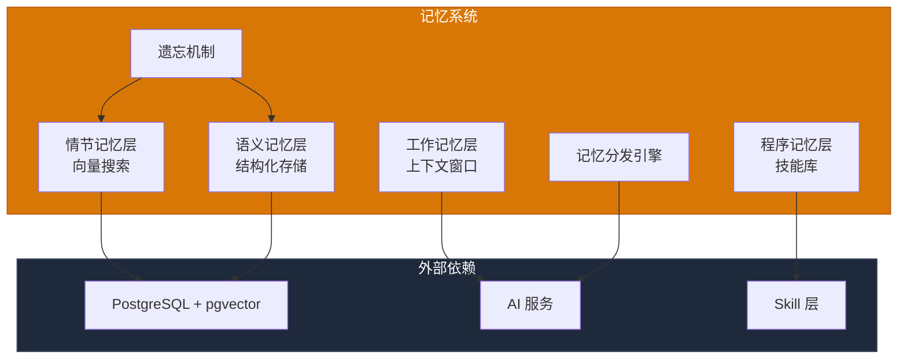
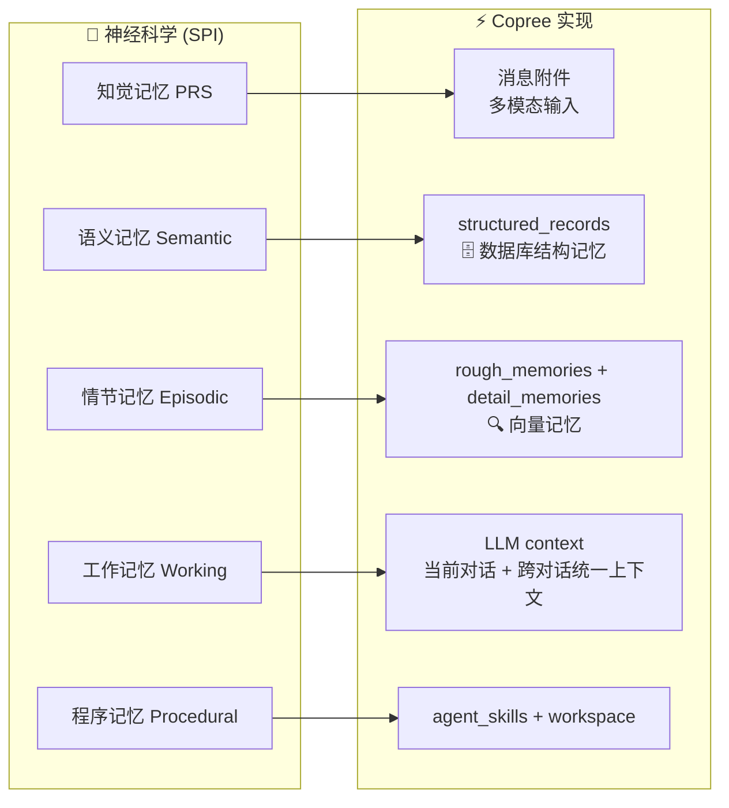
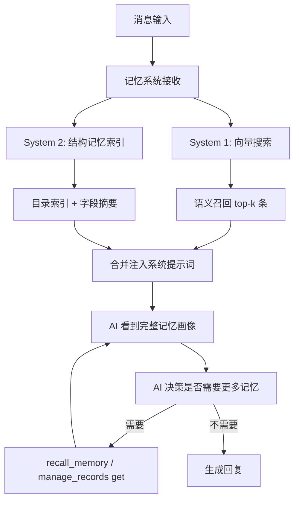
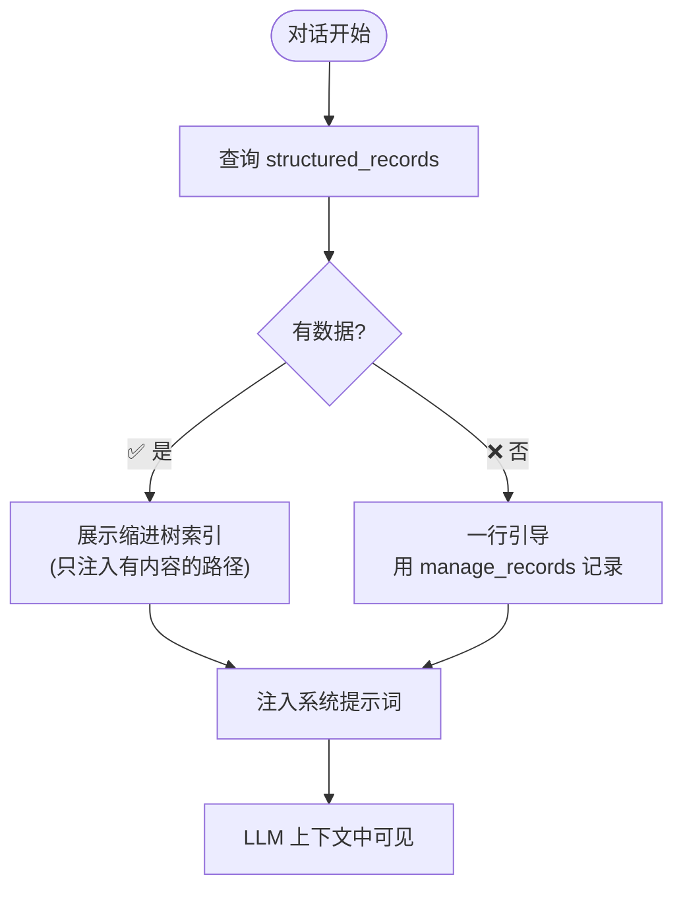
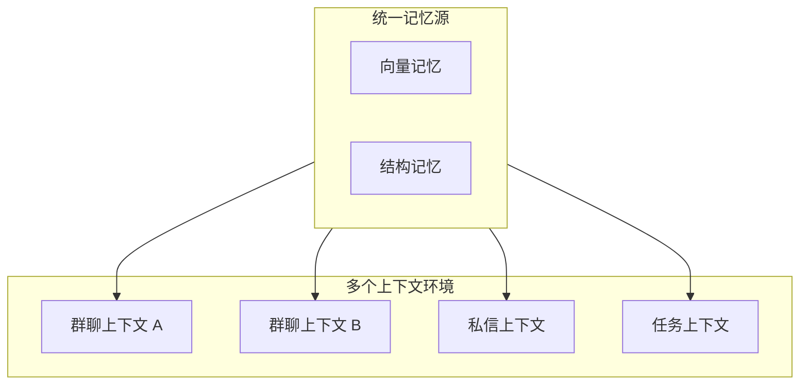
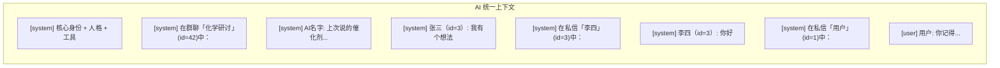
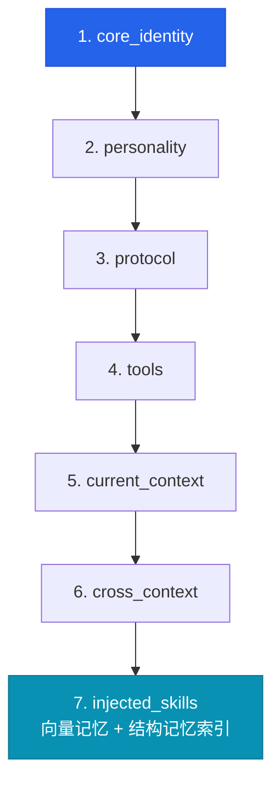

# AI 记忆系统设计文档

> **服务定位**：模拟人类记忆系统，提供分级记忆、结构化记忆、记忆分发能力
> **核心原则**：记忆决定 AI 的上下文内容，不同上下文共享记忆天然同步
> **版本**：v0.3.6
> **日期**：2026-08-15
> **文档规范**：设计类文档统一结构，语言规范，命名规范
>
> **相关文档**：[向量检索与 Embedding 配置](./vector_search_and_embedding.md)
> （Embedding 插件化 / 维度配置 / 前端图形化 / 检索策略 / 索引性能）

---

## 目录

1. [核心设计理念](#一核心设计理念)
2. [服务架构](#二服务架构)
3. [双重记忆架构](#三双重记忆架构)
4. [记忆决定上下文](#四记忆决定上下文)
5. [天然同步机制](#五天然同步机制)
6. [记忆分发引擎](#六记忆分发引擎)
7. [分级记忆 + 遗忘机制](#七分级记忆--遗忘机制)
8. [工作记忆层](#八工作记忆层)
9. [工具接口](#九工具接口)
10. [关键文件索引](#十关键文件索引)
11. [API 端点](#十一api-端点)

---

## 一、核心设计理念

| 理念 | 说明 |
|------|------|
| **模拟人类记忆** | 基于神经科学 SPI 模型，实现情节记忆、语义记忆、程序记忆 |
| **结构化记忆** | 目录层级组织，精确存取，百万级无压力 |
| **记忆决定上下文** | 记忆系统主动构建 AI 的上下文内容 |
| **天然同步** | 不同上下文环境共享同一记忆源，天然保持同步 |
| **记忆分发** | 记忆系统按需分发记忆给 API，节省调用成本 |
| **分级记忆 + 遗忘机制** | 重要性分级，自动遗忘不重要的记忆 |

---

## 二、服务架构



---

## 三、双重记忆架构

### 3.1 映射关系



### 3.2 System 1: 向量记忆（情节层）

```python
class RoughMemory(Base):
    id: int
    agent_id: int
    title: str
    embedding: list[float]
    created_at: datetime
    importance: float          # 重要性评分 0-1
    accessed_count: int = 0
    last_accessed_at: datetime

class DetailMemory(Base):
    id: int
    agent_id: int
    rough_memory_id: int
    content: str
    embedding: list[float]
    created_at: datetime
```

**特性**：
- 查询方式：pgvector cosine distance 语义搜索（Embedding 提供方可插拔——ollama/api/local，见[向量检索与 Embedding 配置](./vector_search_and_embedding.md)）
- 用途："我记不记得这个事实？"、"那次发生了什么？"
- 特征：模糊召回、语义关联、适合碎片化知识
- **检索策略（v0.3.6 对齐 dsh-mneme）**：关键词命中优先 + 向量补位合并——字面词精确命中总是排最前，向量结果去重补位剩余槽位；向量不可用时自动降级文本检索（功能不受影响）

### 3.3 System 2: 结构记忆（语义层）

```python
class StructuredRecord(Base):
    id: int
    agent_id: int
    category: str              # 顶层目录
    sub_key: str               # 子目录
    field: str                 # 字段名
    value: str                 # 内容
    created_at: datetime
    updated_at: datetime
    
    __table_args__ = (
        UniqueConstraint("agent_id", "category", "sub_key", "field"),
    )
```

**目录语义**：

| 目录 | 含义 | 示例 |
|------|------|------|
| `people/` | 人：信息、偏好、关系 | `people/张三/偏好: 喜欢简洁` |
| `topics/` | 事：知识、观点 | `topics/物理/力学: 已掌握F=ma` |
| `tasks/` | 任务：进度、待办 | `tasks/项目A/进度: 80%` |
| `journal/` | 日志：反思、事件 | `journal/2026-07/01: ...` |

**特性**：
- 查询方式：精确 key 查找，目录层级遍历
- 用途："学生 X 的有机化学水平如何？"、"项目 Y 的进度是什么？"
- 特征：精确存取、百万级无压力、支持目录浏览

---

## 四、记忆决定上下文

### 4.1 上下文构建流程



### 4.2 记忆索引注入



**索引格式（2026-08-12 瘦身对齐世界版）**：缩进树 + 软锚定，省 token 且 LLM 解析友好：

```
## 记忆索引
project/
  图鉴页面/
    进度
  ⭐当前计划
user/
  ❗偏好
```

- 只注入**有内容的路径**（空目录不出现）；详细 value 不注入，`manage_records get` 按需取
- **⭐=重要记忆 ❗=硬约束**（value 前缀标记 → 索引上提到名字前）：产生 Attention 特征峰值，引导 LLM 优先处理关键约束（软锚定）
- 世界 AI（build_memory_map）与主站 AI（format_db_records_for_prompt）同一套格式规范

**核心原则**：始终展示（空时引导），像人脑先天分区等待经验填充。

---

## 五、天然同步机制

### 5.1 共享记忆模型



### 5.2 同步策略

| 场景 | 同步方式 | 说明 |
|------|---------|------|
| 写入 | 实时写入统一源 | 任何上下文写入都会更新统一记忆源 |
| 读取 | 按需读取 | 各上下文独立读取，天然获取最新数据 |
| 冲突 | 最后写入获胜 | 简单有效的冲突解决策略 |

---

## 六、记忆分发引擎

### 6.1 分发策略

```python
class MemoryDistributionEngine:
    async def get_context_for_ai(
        self,
        agent_id: int,
        context_type: str,
        max_tokens: int,
    ) -> dict:
        """
        根据上下文类型和 token 限制，智能分发记忆：
        1. 查询结构记忆索引（始终注入）
        2. 根据上下文类型语义搜索相关记忆
        3. 按重要性和相关性排序
        4. 裁剪到 token 限制以内
        """
        ...
```

### 6.2 分发优化

| 优化策略 | 说明 |
|---------|------|
| **缓存优化** | 多个 Skill 要同一份数据，只查一次 |
| **预加载** | 事件来了先预热可能需要的状态 |
| **按需加载** | 只加载当前上下文相关的记忆 |
| **压缩摘要** | 旧消息稳定摘要化，保缓存命中率 |

---

## 七、分级记忆 + 遗忘机制

> **现行实现（2026-09-26）**：本节的分级与衰减口径已由 `utils/pure/memory_weight.py`
> （设定权值 1-5 + 时间权值）与 `services/memory/tidy_service.py`（每日整理）取代；
> 下文保留为设计来路，代码里的写回式衰减已删除。


### 7.1 分级模型

```python
class MemoryImportance:
    CRITICAL = 1.0      # 核心身份、人格锚点
    HIGH = 0.8          # 重要人际关系、关键知识
    MEDIUM = 0.5        # 一般知识、普通对话
    LOW = 0.2           # 临时信息、一次性内容
```

### 7.2 遗忘算法

```python
class ForgettingMechanism:
    async def decay_memory(self, agent_id: int) -> None:
        """
        根据遗忘曲线衰减记忆重要性：
        1. 基于时间和访问频率计算衰减因子
        2. 更新记忆的 importance 字段
        3. 删除 importance 低于阈值的记忆
        """
        ...
    
    async def update_importance(
        self,
        memory_id: int,
        accessed: bool = False,
        referenced: bool = False,
    ) -> None:
        """
        更新记忆重要性：
        - 被访问：+0.1
        - 被引用：+0.2
        - 超过 1.0 封顶
        """
        ...
```

### 7.3 遗忘阈值

| 记忆类型 | 阈值 | 说明 |
|---------|------|------|
| 结构记忆 | 0.1 | 结构化信息不易遗忘 |
| 向量记忆 - rough | 0.1 | 标题级记忆 |
| 向量记忆 - detail | 0.05 | 详细内容记忆 |

---

## 八、工作记忆层

### 8.1 统一上下文



### 8.2 上下文布局



---

## 九、工具接口

### 9.1 记忆工具

| 工具 | 功能 |
|------|------|
| `store_memory` | 存储向量记忆 |
| `recall_memory` | 召回向量记忆 |
| `manage_records` | 管理结构记忆（set/get/list/summary/categories/delete/rename/move） |

### 9.2 manage_records 接口

| action | 说明 |
|--------|------|
| `set` | 写入字段（upsert） |
| `get` | 读取字段/全部 |
| `list` | 列出子目录 |
| `summary` | 生成快照摘要 |
| `categories` | 列出所有顶层目录 |
| `delete` | 删除（精确到 field） |
| `rename` | 改名（level=category/sub_key/field，任一级） |
| `move` | 移动（整组 sub_key 或单条 field 跨目录） |

> 2026-08-12 新增 rename/move：AI 可以重命名记忆目录/记忆名、把记忆移动到别处，不用再 delete+set 重建（避免丢 updated_at）。

---

## 十、关键文件索引

| 文件 | 职责 |
|------|------|
| `backend/app/services/memory_service.py` | 记忆系统核心逻辑 |
| `backend/app/services/vector_memory_service.py` | 向量记忆 CRUD |
| `backend/app/services/structured_memory_service.py` | 结构记忆 CRUD |
| `backend/app/services/memory_distribution.py` | 记忆分发引擎 |
| `backend/app/services/memory/tidy_service.py` | 记忆整理（低权值清理 + 待归档去重，每日） |
| `backend/app/tools/memory/store_memory.py` | 存储记忆工具 |
| `backend/app/tools/memory/recall_memory.py` | 召回记忆工具 |
| `backend/app/tools/memory/manage_records.py` | 管理记录工具 |
| `backend/app/models/rough_memory.py` | 向量记忆 ORM |
| `backend/app/models/detail_memory.py` | 详情记忆 ORM |
| `backend/app/models/structured_record.py` | 结构记忆 ORM |

---

## 十一、API 端点

| 方法 | 路径 | 说明 |
|------|------|------|
| POST | `/memory/store` | 存储记忆 |
| POST | `/memory/recall` | 召回记忆 |
| POST | `/memory/records` | 管理结构记录 |
| GET | `/memory/index/{agent_id}` | 获取记忆索引 |
| DELETE | `/memory/cleanup/{agent_id}` | 清理过期记忆 |

---

## 十二、注意点（2026-08-04 实战结论）

### 12.1 工具 ≠ Skill：区别在决策权

把 `store_memory` / `recall_memory` 包一层就叫 MemorySkill **是误解**：

| 维度 | 工具（Tool） | 自治 Skill |
|------|-------------|-----------|
| 触发 | 被动，等 LLM 在对话中调用 | 主动，事件到达自己决定 |
| 决策者 | LLM | `should_act`（自身规则/状态） |
| 闭环 | 单点执行 | 感知 → 决策 → 执行 |
| 状态 | 无 | State Skill 可维护 |

**教训**：曾实现过一个"MemorySkill"（订阅消息事件 + 信号词硬规则 + 调 auto_store_memory），
但 recall 仍是工具形态——只是把 store 的触发权从 LLM 挪到规则，工具与 Skill 并存，
**没有形成真正自治的记忆单元，不构成质变**（已删除，2026-08-04）。

真正的 MemorySkill 化标准：**记忆的存取都成为 AI 自身能力**，不依赖 LLM 召唤。

### 12.2 记忆归属：群聊消息也是外部感知（设计决策）

**决策**：AI 记忆应统一记在 AI 自己名下（scope=private），
群聊消息与私信消息一样属于 AI 的外部感知，**不应区分"群共享/私信私有"**。

现状差异（待统一）：
- 平台现有 `store_memory` 工具：群聊存 scope='group'（群共享，群内任何 AI 可回忆），私信存 scope='private'
- 目标：统一为 AI 私有（owner=agent, scope='private'），群共享模式需重新评估

影响面：`auto_store_memory` 的 scope 逻辑、`recall_relevant_memories` 的检索范围（群聊回忆时的 group 过滤）。
